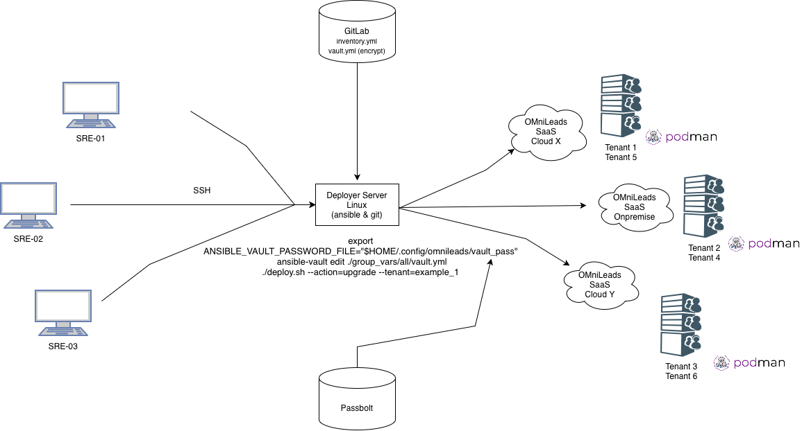
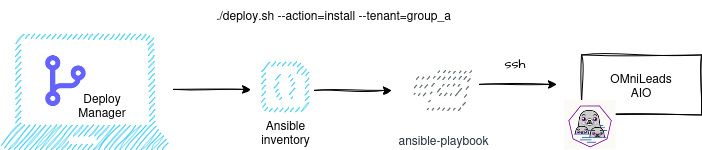
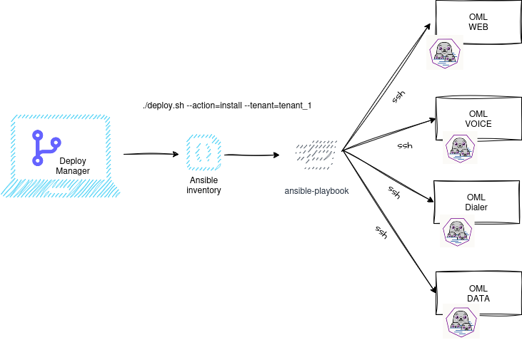
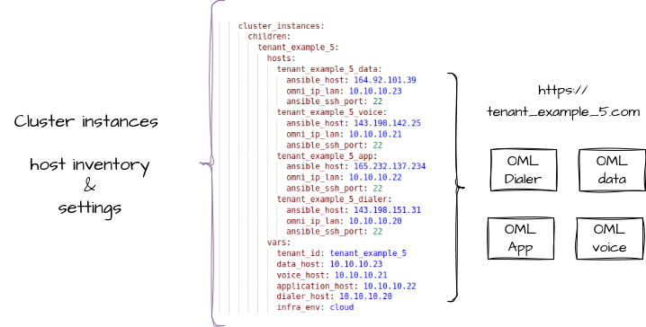
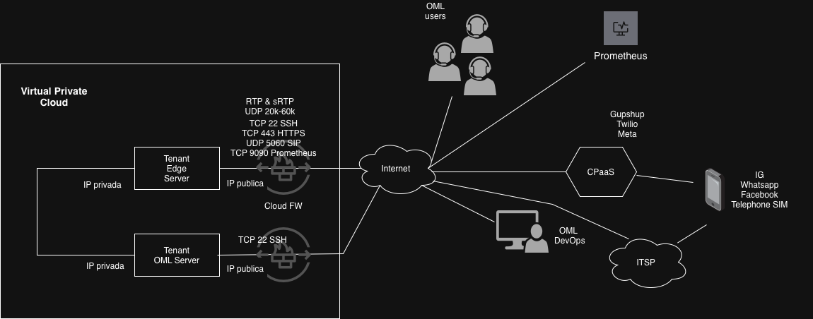
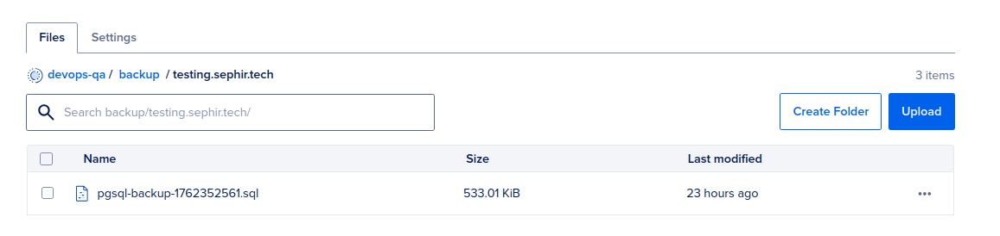
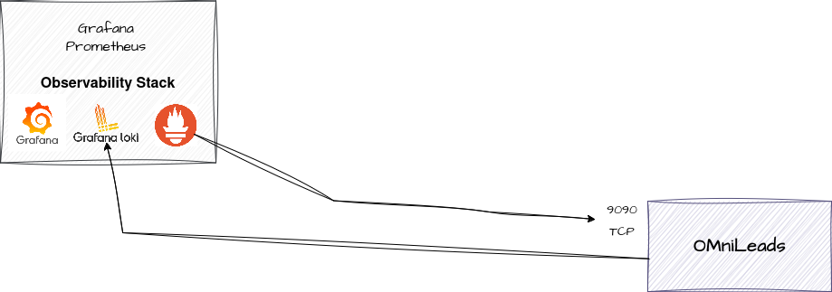
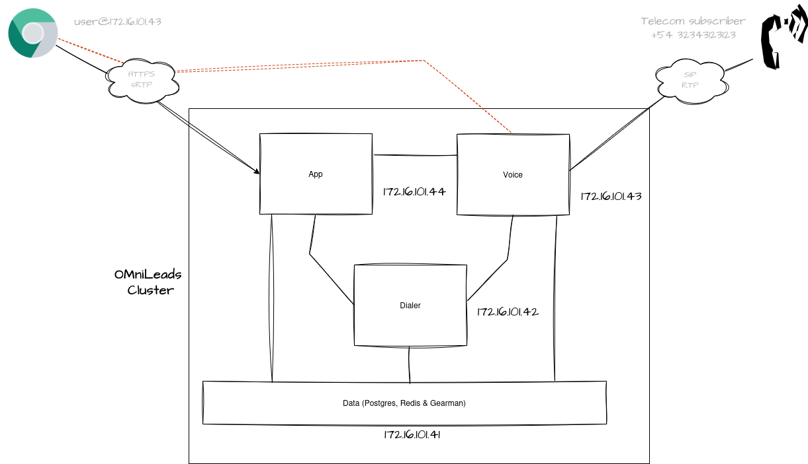

#### This project is part of OMniLeads


#### 100% Open-Source Contact Center Software
#### [Community Forum](https://forum.omnileads.net/)

---

# Index

* [Bash + Ansible](#bash-ansible)
* [Ansible + Inventory](#ansible-inventory)
* [Bash Script deploy.sh](#bash-script-deploy)
* [Subscriber tracking](#subscriber-traking)
* [Deploy all in one (AIO) instance](#aio-deploy)
* [Automatic Dialer](#dialer)
* [TLS Certs provisioning](#tls-cert-provisioning)
* [Security](#security)
* [OMniLeads Podman containers](#podman-systemd)
* [Asterisk Dialplan & other customizations](#asterisk_customizations)
* [Container image & tag customizations](#components_img)
* [Deploy OMniLeads Enterprise](#oml_enterprise)
* [Deploy a backup](#backups)
* [Deploy a restore](#restore)
* [Deploy an upgrade](#upgrades)
* [Deploy a rollback](#rollback)
* [Observability](#observability)
* [Scalability](#scalability)
* [Deploy Cluster all in three (AIT) instance](#ait-deploy)
* [Deploy an upgrade from OMniLeads 2.X](#upgrade_from_oml2)
* [User docs](#user-docs)

# OMniLeads automation your tenant deploys with Ansible

Para los pasos previos de preparación del entorno, ver [ANSIBLE_BOOTSTRAP.md](ANSIBLE_BOOTSTRAP.md).

```
git clone https://gitlab.com/omnileads/omldeploytool.git
cd omldeploytool/ansible
```

In this section, we will find a tool manager for OMniLeads that will allow us to carry out deployments:

* New instances
* Upgrades & rollbacks
* Backup & restore

It is possible to manage hundreds of OMniLeads instances with Ansible inventories.



Then, for each running instance, a collection of components invoked as systemd services implement OMniLeads functionalities on the Linux instance (or set of instances).

Each OMniLeads instance involves the following collection of components that are run on a container. 
It is possible to group these containers on a single Linux instance or cluster them horizontally in a configuration.

>  Note: If working on a VPS with a public IP address, it is a mandatory requirement that it also has a network interface with the ability to associate a private IP address.

## Bash + Ansible 📋 <a name="bash-ansible"></a>

An instance of OMniLeads is launched on a Linux server (using Systemd & Podman) by running a bash script (deploy.sh) along with its input parameters and a set of Ansible files (Playbooks + Templates) that are invoked by the script.

## Bash Script deploy.sh 📄 <a name="bash-script-deploy"></a>

This executable script triggers the deploy actions. It is responsible for receiving the action parameters to execute and the tenant on which to deploy the action.

The script resolves the inventory (either `instances/<tenant>/inventory.yml` when using **--tenant=**, or an absolute path with **--inventory=**) and runs `ansible-playbook` against [playbooks/site.yml](playbooks/site.yml) (or other playbooks for operational actions) with the appropriate **--tags**.

```
./deploy.sh --help
```

Typical parameters:

* **--action=** (see `./deploy.sh --help`, including `layout-cluster`, `layout-aio`)
* **--tenant=** and/or **--inventory=**

If you pass **--inventory=/path/to/prod.yml** without **--tenant=**, `tenant_folder` for files under `instances/<tenant>/` (TLS certs, keys, etc.) defaults to the inventory basename (`prod` in this example). Override with **--tenant=** if your folder name differs.

Partial actions (`voice`, `postgres`, `redis`, …) only run tasks with matching tags; run **install** first on new servers. The `prerequisitos` role tags Podman and the `omnileads` network so component-scoped actions still bring up container networking when needed.

**Operational playbooks** (backup, restore, recycle) live under [components/](components/README.md). The public clone may ship placeholders that explain how to add your organization’s real playbooks.

for example: 

```
./deploy.sh --action=install --tenant=tenants_folder_name
```

## Ansible 🔧 <a name="ansible-inventory"></a>

Ansible allows you to run a number of tasks on a set of hosts specified in your inventory file. Depending on the structure and variables of this file, OMniLeads instances based on podman containers can be launched .

This tool is capable of deploying OMniLeads in two layouts:

* **OML All in One with Podman & Systemd:**


* **OML  Cluster with Podman & Systemd:**


The following is the generic version of inventory.yml file available in this repository.

In the first section of the file you can list the different hosts grouped by tenant and by type of deployment (All in one or Cluster).

AIO instances:


Cluster instances:



In the second section of the file you can parameterize the runtime variables. By default it affects ALL declared instances, unless the same variable is declared within the host or group specific variables section.

Finally, we have the section where the hosts should be grouped by deployment architecture.

* **omnileads_aio**: instancias **todo-en-uno (AIO)**.
* **omnileads_data**: Postgres, Redis, MinIO, Gearman (estado y servicios de datos del cluster).
* **omnileads_edge**: telefonía de borde (Kamailio, RTPengine, etc.).
* **omnileads_nodes**: **cómputo monolítico** del cluster (pods `acd`, `omlapp_web`, `omlapp_workers`, `dialer_workers`, `callrec_processor`, `observability`, etc.). Es el modo **legacy** compatible con inventarios anteriores: un host (o varios) con todo el cómputo en `omnileads_nodes`.
* **omnileads_web** (opcional): cómputo **capa web/app** — pods `omlapp_web` y `observability` (Django/Daphne, websockets, nginx, dialer API, addons, Prometheus…).
* **omnileads_workers** (opcional): cómputo **workers** — pods `dialer_workers`, `omlapp_workers`, `callrec_processor` y `observability`.
* **omnileads_acd** (opcional): **ACD** — pod `acd` y `observability`.

Para un mismo tenant de cluster usá **o** `omnileads_nodes` (todo el cómputo junto) **o** la combinación `omnileads_web` + `omnileads_workers` + `omnileads_acd` (cómputo segregado), más `omnileads_data` y `omnileads_edge`; no mezclés el mismo host en `omnileads_nodes` y a la vez en web/workers/acd con roles duplicados.

El play de instalación/actualización de cluster (`ansible/playbooks/site.yml`, `cluster.yml` y `deploy.sh` con layout cluster) incluye **`omnileads_data:omnileads_edge:omnileads_web:omnileads_workers:omnileads_acd:omnileads_nodes:omnileads_aio`** en `hosts` (los grupos vacíos se omiten en la práctica).


```
omnileads_aio:
  hosts:
    #tenant_example_1:
    #tenant_example_2:

##################### Cluster (data / edge / nodes o split web+workers+acd) ###########################

omnileads_data:
  hosts:
    #tenant_example_5_data:  
    #tenant_example_6_data:  
    
omnileads_edge:
  hosts:
    #tenant_example_5_edge:
    #tenant_example_6_edge:

omnileads_web:
  hosts:
    # tenant_example_split_web:

omnileads_workers:
  hosts:
    # tenant_example_split_workers:

omnileads_acd:
  hosts:
    # tenant_example_split_acd:

omnileads_nodes:
  hosts:
    #tenant_example_5_node_A:
    #tenant_example_5_node_B:
```

# Inventory file :office: <a name="subscriber-traking"></a>

In order to manage multiple instances (or group of them) from this deployment tool, you must create
a folder called **instances** at the root of this directory. The reserved name for this folder is
**instances** since said string is inside the .gitignore of the repository.

```
mkdir instances
```

Then, for each *instance* to be managed, a sub-folder must be created within instances.
For example:

```
mkdir instances/cloud_oml
mkdir instances/onpremise_oml
mkdir instances/company_A_omls
```

Once the tenant folder is generated, there you will need to place a copy of the *inventory.yml* file available
in the root of this repository, in order to customize and tack inside the private GIT repository.

```
cp inventory.yml instances/cloud_oml/
cp inventory.yml instances/onpremise_oml/
cp inventory.yml instances/company_A_omls/
```

Then, once we have adjusted the inventory.yml file inside the tenant's folder, we can trigger its deployment.

```
./deploy.sh --action=install --tenant=cloud_oml
```

# Install on Linux instance 🚀 <a name="aio-deploy"></a>

You must have a generic Linux instance (Redhat or Debian based) with with internet access and your public SSH key available, as Ansible needs to establish an SSH connection using the public key.
The important thing is that the selected distribution has a version of Podman (3.0.0 or higher) available in its repositories. Something that we know Debian, Ubuntu, Rocky, or Alma Linux have.

Then you should work on the inventory.yml tenant file.

```
###############################################################################################################
##############################   The complete list of host  ################################################### 
###############################################################################################################
all:
  children:
    # -----------------------------------------
    # -----------------------------------------
    aio_instances:
      hosts:
        algarrobo:
          tenant_id: algarrobo
          ansible_host: 190.19.150.18
          omni_ip_lan: 172.16.101.44
          infra_env: cloud
          fqdn: tenant_name.omnileads.net
          certs: certbot
```

### "infra_env" variable

The infra_env variable determines the network configuration and the intended access method for the instance. It accepts one of the following values:

  * lan: Configures access for a Local Area Network (LAN) using a local IP address or FQDN.
  * cloud: Configures external access via a public IP address or FQDN (WAN access).
  * nat: Configures the instance for deployment behind a NAT device (requires external IP/FQDN setup).
  * custom: Allows writing custom Asterisk PJSIP parameters and RTPengine settings for more complex network scenarios.
  * all: Opens required ports on all network interfaces.

### nat_ip_addr variable

The nat_ip_addr variable is utilized when infra_env is set to nat. You may optionally uncomment this variable and specify the external NAT IP address (e.g., nat_ip_addr: X.X.X.X). If this variable is left commented or empty, the system will attempt to auto-discover the NAT IP address.

### External Service Configuration

The **bucket_url** and **postgres_host** parameters must be commented out if you plan to use external services (such as cloud-based or external self-hosted PostgreSQL or Object Storage). By commenting these out, you prevent the deployment of these storage components alongside the OMniLeads instance.

Then in the vars section, we have all the parameters that omnileads expects to work. These variables affect all the hosts that are going to be managed from this inventory.yml. 

```
    # ------------------------------------------------------------------------------------------------ #
    # ------------------------------ Generic OMniLeads runtime variables ----------------------------- #
    # ------------------------------------------------------------------------------------------------ #

    infra_env: cloud
    #nat_ip_addr: X.X.X.X
    #fqdn: fts.sefirot.cloud
    TZ: America/Argentina/Cordoba
    certs: selfsigned
    ....
    ....
    ....
```

In the last section of the file, list each host under the group that matches its role: **omnileads_aio** for AIO, or for cluster **omnileads_data**, **omnileads_edge**, and **omnileads_nodes** (cómputo monolítico) and/or **omnileads_web**, **omnileads_workers**, **omnileads_acd** (cómputo segregado).

```
#############################################################################################################
# -- In this section the hosts are grouped based on the type of deployment (AIO, Cluster).     #
#############################################################################################################

omnileads_aio:
  hosts:
    algarrobo:
    #tenant_example_3:
    #tenant_example_4:
    #tenant_example_2:

omnileads_data:
  hosts:
    #tenant_example_5_data:
    #tenant_example_6_data:
    
omnileads_edge:
  hosts:
    #tenant_example_5_edge:
    #tenant_example_6_edge:

omnileads_nodes:
  hosts:
    #tenant_example_5_node_A:
    #tenant_example_5_node_B:
```

Let's run the bash scrip:

```
./deploy.sh --action=install --tenant=tenant_name_folder
```

We can log in:

```
https://tenant_name.omnileads.net
user *admin*
password *admin*. 
```
# Automatic Dialer 📞 <a name="dialer"></a>

In the DIALER section of the inventory.yml file, you can choose between two Engines:

* OMniDialer is part of the OMniLeads FLOSS stack.
* Wombat Dialer is an alternative engine developed by Loway.

If you select OMniDialer, the following parameters must be adjusted:

* dialer_caps: This is the number of call attempts per second (CAPS).
* dialer_process_campaign_replicas: This is the number of campaign processes. You should have as many replicas as the number of simultaneous campaigns you plan to run.

```
    # --- The Dialer Engine: omnidialer or wombat.
    dialer_engine: omnidialer
    # --- Call attempts per second
    dialer_caps: 1
    # --- Number of dialer container replicas
    dialer_process_campaign_replicas: 10
```

# TLS/SSL certs provisioning :closed_lock_with_key: <a name="tls-cert-provisioning"></a>

From the inventory variable *certs* you can indicate what to do with the SSL certificates.
The possible options are:

### selfsigned
which will display the self-signed certificates (not recommended for production).

### certbot 
deploy an instance with automatically generated Let's Encrypt SSL certificates.

When working with self-generated certificates in the deployment using Certbot, we must ensure that our instance has DNS resolution based on our FQDN. Additionally, we must ensure that our port 80 is accessible from the certificate authority and set a valid email box in order to recieve TLS renew notifications from Let's & crypt.

```
certs: certbot
fqdn: omlinstance.domain.com
notification_email: your_email@domain.com
```

### custom

if the idea is to implement your own certificates. Then you must place them inside instances/tenant_name_folder/ with the names: *cert.pem* for and *key.pem*
Custom certificates should be placed within the folder where we store the inventory file used to manage the instances, i.e., *instances/tenants_folder*.

If we are going to use *certs: custom*, then the certificate and key files should be named *cert.pem* and *key.pem*. Although we can also use different names, in that case, instead of using *certs: custom*, we must change it to:

```
aio_instances:
      hosts:
        algarrobo:
          tenant_id: algarrobo
          ansible_host: 190.19.150.18
          omni_ip_lan: 172.16.101.44
          infra_env: cloud
          fqdn: tenant_name.omnileads.net
          cert_file_name: cert_custom_filename.pem
          key_file_name: key_custom_filename.pem 
```

```
./deploy.sh --action=install --tenant=cloud_oml
```

# Security 🛡️ <a name="security"></a>

OMniLeads is an application that combines Web (https), WebRTC (wss & sRTP) and VoIP (SIP & RTP) technologies. This implies a certain complexity and 
when deploying it in production under an Internet exposure scenario. 

On the Web side of the things the ideal is to implement a Reverse Proxy or Load Balancer ahead of OMnileads, i.e. exposed to the Internet (TCP 443) 
and that it forwards the requests to the Nginx of the OMniLeads stack. On the VoIP side, when connecting to the PSTN via VoIP it is ideal to 
operate behind an SBC (Session Border Controller) exposed to the Internet.

However, we can intelligently use the **Cloud Firewall** technology when operating over VPS exposed to the Internet.



Below are the Firewall rules to be applied on All In One instance:

* 443/tcp Nginx: This is where Web/WebRTC requests to Nginx are processed. Port 443 can be opened to the entire Internet.

* 20000/30000 UDP WebRTC sRTP RTPengine: this port range can be opened to the entire Internet.

* 5060/UDP Asterisk: This is where SIP requests for incoming calls from the ITSP(s) are processed. This port must be opened by restricting by origin on the IP(s) of the PSTN SIP termination provider(s).

* 40000/50000 UDP: VoIP RTP Asterisk: this port range can be opened to the entire Internet.

* 9090/tcp Prometheus: on compute / AIO hosts (`omlapp_web` / `omnileads_aio`), Prometheus is published on `omni_ip_lan:9090` (Podman `PublishPort`). External access is recommended via HAProxy on the edge host at `https://<fqdn>/prom`, with source IP restriction using inventory variable `haproxy_prom_allowed_src` (list of CIDRs). If `haproxy_prom_allowed_src` is empty, `/prom` is denied by default. You may still open `9090/tcp` only to your monitoring center on the LAN if you prefer direct scrape.


## Systemd & Podman 🔧 <a name="podman-systemd"></a>

Then, once OMnileads is deployed on the corresponding instance/s, each container on which a component works
can be managed as a systemd service.

```
systemctl start component
systemctl restart component
systemctl stop component
```

Behind every action triggered by the systemctl command, there is actually a Podman container that is launched, stopped, or restarted. This container is the result of the image invoked along with the environment variables.

For example, if we look at the Nginx component, the Quadlet unit is `/etc/containers/systemd/nginx.container`; systemd still exposes the generated unit as `nginx.service` (same `systemctl` name as before).

`/etc/containers/systemd/nginx.container` looks like:

```
[Unit]
Description=OMniLeads nginx reverse proxy (Podman Quadlet)
Wants=network-online.target
After=network-online.target
RequiresMountsFor=%t/containers

[Container]
ContainerName=oml-nginx-server
Image=docker.io/omnileads/nginx:230215.01
Network=host
EnvironmentFile=/etc/default/nginx.env
Volume=/etc/omnileads/certs:/etc/omnileads/certs
Volume=django_static:/opt/omnileads/static
Volume=django_callrec_zip:/opt/omnileads/asterisk/var/spool/asterisk/monitor
Label=tier=omlapp
LogDriver=journald
PodmanArgs=--cgroups=no-conmon
Notify=true

[Service]
Restart=on-failure
TimeoutStopSec=70

[Install]
WantedBy=default.target
```

/etc/default/nginx.env looks like:

```
DJANGO_HOSTNAME=172.16.101.221
DAPHNE_HOSTNAME=172.16.101.221

KAMAILIO_HOSTNAME=127.0.0.1
WEBSOCKETS_HOSTNAME=172.16.101.221
ENV=prodenv

S3_ENDPOINT=http://172.16.101.221:9000
```

This is the standard for all components.

# Asterisk dialplan and other customizations 🛡️ <a name="asterisk_customizations"></a>

Based on containers, code customizations made within the container are ephemeral. To make permanent modifications to the Asterisk dialplan, scripts, or configurations, it's recommended to use custom images:

An example of how to do this is outlined in this [repo](https://gitlab.com/omnileads/acd-customizations-example/)

# Use your own container registry & images  <a name="components_img"></a>

In the inventory file you can customize the tags of the images to display, as well as the registry from where to download them.

```
    # ------------------------------------------------------------------------------------------------ #
    # ---------------------------- Container IMG TAG customization ----------------------------------- #
    # ------------------------------------------------------------------------------------------------ #
    
    # --- For each OML Deploy Tool release, a versioned stack with the latest stable images of each component is maintained on inventory.yml
    # --- You can combine the versions as you like, also use your own TAGs, using the following TAG version variables
    
    omnileads_img: your_registry/omlapp:231227.01
    asterisk_img: your_registry/asterisk:240102.01
    
    # --- Activate the OMniLeads Enterprise Edition.
    # --- on the contrary you will deploy OMniLeads OSS Edition with GPLV3 licensed. 
    
    enterprise_edition: false
```

## OMniLeads Enterprise :office: <a name="oml_enterprise"></a>

What is OMniLeads Enterprise?

It is an additional layer with complementary modules to OMniLeads Community (GPLV3). It includes functionalities such as advanced reports, wallboards, and automated satisfaction surveys implemented as modules.

This version can be implemented simply by referencing the image for the container that implements the web application.
Therefore, in our "inventory.yml" variable file, we must invoke the enterprise imag e. To do this, we add the string "-enterprise" to the end of the tag that describes the image of the omnileads_img component:

```
omnileads_img: docker.io/your_registry/omlapp:231227.01-enterprise
```

# Perform a Backup :floppy_disk: <a name="backups"></a>

Deploying a backup involves the the databases SQL (omlapp & omnidialer).
The idea behind the backup scheme is to centralize the backups from different OMniLeads instances in a single Bucket.

### Prerequisites 

You must have an S3-Compatible Bucket (external to the OML instance) available to host the backups. The necessary parameters can be found in the "BACKUP AUTOMATION" section of the inventory.yml file.

```
    #####################################################################################################
    #                                       BACKUP AUTOMATIONS                                          #
    #####################################################################################################
    # Enable daily PostgreSQL Database backups into centralized Object Storage bucket

    # backup_bucket_url: https://sfo3.digitaloceanspaces.com
    # backup_bucket_name: your-tenants-backup-bucket
    # backup_bucket_access_key: lfkdhsfjkldhsjkh54jkh5jk3h4jk5h34
    # backup_bucket_secret_key: KkjhjkKJHJKH78678hjghjgHJGHJjhghjgjhjg67567

    # --- if your bucket use a selfsigned SSL cert, uncomment and put this value to true
    # backup_bucket_dont_verify_ssl: False

    # Time format from 00:00 to 23:59
    # cron_backup_mm: 00
    # cron_backup_hh: 01 

    # For restore from backup, uncomment and put here the backup filename
    # backup_filename: backup/tenant_name/psql-filename.sql
```

### Auto backups

Activating this configuration schedules daily backups via the CRON service on the OML host Operating System. The exact time for execution is defined by the parameters provided.

### On demand backups

It is also possible to initiate a backup on demand by utilizing the deploy.sh script.
To launch a backup, simply call the deploy.sh script:

```
./deploy.sh --action=backup --tenant=tenant_name_folder
```

### Backup file

The backup is deposited in the bucket, being under the backup folder on one side a .sql file with the timestamp and on the other side another directory is generated with the timestamp date.



# Upgrades :arrows_counterclockwise:  <a name="upgrades"></a>

The OMniLeads project builds images of all its components to be hosted in docker hub: https://hub.docker.com/repositories/omnileads.

Each new release involves an update of code and variables on the **omldeploytool** repository. 
You can verify the image behind the component by inspecting the 'group_vars/all' file.

Therefore a new Release of the application becomes available as an image in the container registry, it will be impacted
the **Releases-Notes.md** file available in the root of this repository, which exposes the mapping between the
versions of the images of each component for each release.


https://gitlab.com/omnileads/omldeploytool/-/blob/main/ansible/group_vars/all?ref_type=heads

```
git pull origin main
git checkout release-2.6.0
```

Then indicate at the inventory.yml level within the corresponding tenant folder, the versions
desired, for example:

```
omnileads_img: docker.io/omnileads/omlapp:240201.01
asterisk_img: docker.io/omnileads/asterisk:240102.01
```

Then the deploy.sh script must be called with the --upgrade parameter.

```
./deploy.sh --action=upgrade --tenant=tenant_name_folder
```

# Rollback  :leftwards_arrow_with_hook: <a name="rollback"></a>


The use of containers when executing the OMniLeads components allows us to easily apply rollbacks towards versions
frozen history and accessible through the "tag".

```
omnileads_img: docker.io/omnileads/omlapp:240117.01
asterisk_img: docker.io/omnileads/asterisk:240102.01
fastagi_img: docker.io/omnileads/fastagi:240104.01
astami_img: docker.io/omnileads/astami:231230.01
nginx_img: docker.io/omnileads/nginx:240105.01
websockets_img: docker.io/omnileads/websockets:231125.01
kamailio_img: docker.io/omnileads/kamailio:231125.01
rtpengine_img: docker.io/omnileads/rtpengine:231125.01
redis_img: docker.io/omnileads/redis:231125.01
```

Then the deploy.sh script must be called with the --upgrade parameter.

```
./deploy.sh --action=upgrade --tenant=tenant_name_folder
```

# Restore :clock9: <a name="restore"></a>


You can proceed with a restore on a fresh installation as well as on a productive instance. 

Apply restore on the new instance. The **backup_filename** parameter is to indicate the restore file that we want to execute.

```
aio_instances:
      hosts:
        algarrobo:
          tenant_id: algarrobo
          ansible_host: 190.19.150.18
          omni_ip_lan: 172.16.101.44
          infra_env: cloud
          backup_filename: backup/GML_AIO/pgsql-backup-1762353574.sql
```

Run install deploy in case of fresh install instance:

```
./deploy.sh --action=install --tenant=digitalocean_deb
```

or run restore in case of productive instance:


```
./deploy.sh --action=restore --tenant=oml_tenants
```

# Observability :mag_right: :bar_chart: <a name="observability"></a>

Inside each subscriber linux instance the deployer put some containers in order to not only be able to 
to observe metrics at the operating system level but also to obtain specific metrics of components such as redis, postgres or asterisk, 
as well as to get the logs of the operating system and the also to get the logs of the operating system and the components and send them to the observability stack.

This allows us to propose a multi-instance observability center. On which it is possible to centralize the monitoring of OS and application metrics
of the OS and the application and its components, as well as centralizing log analysis.

This is possible thanks to the Prometheus approach together with its exporters for metrics monitoring on the one hand, and Loki and Promtail on the other. 
while Loki and Promtail implement the centralization of logs.

* **Loki**: used to storage file logs generated by OMniLeads components like django, nginx, kamailio, etc.
* **Promtail**: used to parse logs file on Linux VM nd send this to Loki DB.



Finally, you will be able to have an instance of Grafana and Prometheus that invoke this Prometheus deployed on tenat like data-source in order
to them build dashboards, on the other hand Grafana must to invoke the Loki deployed on tenant like data-source for logs analisys.

.

Centralized observability.

# Scalability settings <a name="#scalability"></a>

The default installation deploys components in a generic configuration that may perform well for instances with up to 20 or 30 users. To scale to a higher number of users, it is necessary to apply certain optimizations through the inventory.yml file.

### Asterisk:


```
    # RTP port range
    acd_rtp_port_min: 40000
    acd_rtp_port_max: 50000

    # If you set scale_asterisk to true, then you must assign values to
    # asterisk_mem_limit, pjsip_threadpool_idle_timeout & pjsip_threadpool_max_size
    # https://docs.asterisk.org/Deployment/Performance-Tuning/ 
    
    # scale_asterisk: true
    # acd_pod_cpus: 1
    # asterisk_mem_limit: 1G
    # pjsip_threadpool_idle_timeout: 120
    # pjsip_threadpool_max_size: 25 # 25 for 4 cores, 50 for 8 cores
    # pjsip_threadpool_initial_size=8 # number of cores x 2
    # pjsip_threadpool_auto_increment=5
    # pjsip_timer_t1=100
    # pjsip_timer_b=6400
    # stasis_initial_size = 10
    # stasis_idle_timeout_sec = 120
    # stasis_max_size = 60
```

### OMniLeads App UWSGI:

This is the application server that powers the OMniLeads Django application.
By setting the scale_uwsgi value on the host or group, you enable the ability to specify the number of processes and threads it will handle.

```
    # scale_uwsgi: true
    # uwsgi_processes: 8
    # uwsgi_threads: 1
    # uwsgi_listen_queue_size: 2048
    # uwsgi_worker_reload_mercy: 60
    # uwsgi_evil_reload_on_rss: 3096
```

### PostgreSQL:

```
    # scale_postgres: True
    # postgres_max_connections: 20 # max(4 * number of CPU cores, 100)
    # postgres_shared_buffers: 1GB #  Min 128kB Max 25% of total MEM RAM
    # postgres_idle_in_transaction_session_timeout: 60000 # max time in milliseconds that a session can remain idle, 0 is disabled
    # postgres_statement_timeout: 60000 # query timeout in milliseconds, 0 is disabled
    # postgres_effective_cache_size: 4GB # between 50% and 75% of total MEM RAM
    # postgres_wal_buffers: 32MB # between 64KB & 16MB
    # postgres_checkpoint_timeout: 10min # range 30s-1d s (sec), min (minutes), h (hour) or d (days)
    # postgres_work_mem:  12MB # Increase the working memory to allow for more complex query operations
    # postgres_maintenance_work_mem: 128MB # Increase the maintenance memory to speed up vacuum and index creation operations
```

### Redis:

```
    # scale_redis: True
    # redis_maxmemory: 2gb
    # redis_maxmemory_policy: allkeys-lru
    # redis_tcp_backlog: 511
    # redis_maxclients: 2000
    # redis_lazyfree_lazy_eviction: yes
    # redis_lazyfree_lazy_expire: yes
```

### Kamailio:

```
    # kamailio shm & pkg memory params 
    # https://www.kamailio.org/wiki/tutorials/troubleshooting/memory
    
    # kamailio_shm_size: 64
    # kamailio_pkg_size: 8
```

### RTPEngine:

```
    # sRTP port range
    rtpengine_rtp_port_min: 20000
    rtpengine_rtp_port_max: 30000

    # If you set scale_rtpengine to true, then you must assign values to 
    # rtpengine_timeout, rtpengine_offer-timeout, rtpengine_silent-timeout & rtpengine_final-timeout
    # https://rtpengine.readthedocs.io/en/latest/rtpengine.html
    
    # rtpengine_timeout: 15
    # rtpengine_offer_timeout: 15
    # rtpengine_silent_timeout: 120
    # rtpengine_final_timeout: 3600
```

### Cluster mínimo: AIO + Edge (2 hosts)

Para un despliegue con **solo dos máquinas** (cómputo + datos en un host, telefonía de borde en otro), el inventario usa el mismo modelo de grupos que un cluster estándar, pero el host “AIO” debe aparecer en **`omnileads_data` y `omnileads_nodes` a la vez** (Postgres, Redis, MinIO, Gearman, ACD, omlapp, dialer, nginx, etc.). **No** lo declares en `omnileads_aio`: si estuviera ahí, el rol `pods` también desplegaría el pod de borde en ese host.

El segundo host va solo en **`omnileads_edge`** (Kamailio, RTPengine, HAProxy hacia nginx en el host de cómputo).

Ejemplo en `inventory.yml` (ver `tenant_example_aio_edge` en `cluster_instances` y en la sección final `omnileads_*`):

```
omnileads_aio:
  hosts:

omnileads_data:
  hosts:
    tenant_example_aio_edge_aio:

omnileads_edge:
  hosts:
    tenant_example_aio_edge_edge:

omnileads_nodes:
  hosts:
    tenant_example_aio_edge_aio:
```

`data_host`, `edge_host` y `aio_host` se infieren con el rol `topology_normalize`. Despliegue: `./deploy.sh --action=install --tenant=<carpeta>`; validación de layout de cluster: `./deploy.sh --action=layout-cluster --tenant=<carpeta>`.

Comprobación rápida tras el despliegue: en el host AIO deben figurar entre otras `data_statefull-pod.service`, `data_stateless-pod.service`, `acd-pod.service`, `dialer_workers-pod.service`, `omlapp_web-pod.service`, `omlapp_workers-pod.service`, `callrec_processor-pod.service`, `observability-pod.service`, y **no** `telephony_edge-pod.service`. En el Edge: `telephony_edge-pod.service`, `observability-pod.service` y `haproxy.service` activos.

Conectividad: HAProxy en Edge debe alcanzar nginx en el AIO por `omni_ip_lan` del AIO (puerto 443 de backend); el ACD en el AIO publica 5060/udp hacia la LAN (accesible al Kamailio del Edge según `kamailio_pstn_out` en `acd.pod.j2`).

### Cluster en 5 hosts (data + edge + web + workers + acd)

Alternativa al cómputo monolítico en `omnileads_nodes`: cinco máquinas — datos, borde, capa web (`omlapp_web`), workers (`dialer_workers`, `omlapp_workers`, `callrec_processor`) y ACD. Cada uno de esos hosts de cómputo lleva además el pod `observability`.

Ejemplo de tenant en `inventory.yml` (`tenant_example_split` bajo `cluster_instances` y asignación final):

```
omnileads_aio:
  hosts:

omnileads_data:
  hosts:
    tenant_example_split_data:

omnileads_edge:
  hosts:
    tenant_example_split_edge:

omnileads_web:
  hosts:
    tenant_example_split_web:

omnileads_workers:
  hosts:
    tenant_example_split_workers:

omnileads_acd:
  hosts:
    tenant_example_split_acd:

omnileads_nodes:
  hosts:
```

Dejá **`omnileads_nodes` vacío** para este layout. El rol `topology_normalize` infiere `nginx_host` / `dialer_host` desde el host en `omnileads_web` y `acd_host` / `fastagi_host` desde `omnileads_acd`.

# Install on Cluster Instances (data, edge & nodes). 🚀 <a name="ait-deploy"></a>

You must have four Linux instances with Internet access and **your public key (ssh) available**, since
Ansible needs to establish an SSH connection to deploy the actions.




Then you should work on the inventory.yml tenant file.

```
# -----------------------------------------
# -----------------------------------------
    cluster_instances:
      children:
        tenant_example_5:
          hosts:
            tenant_example_5_data:
              ansible_host: 164.92.101.39
              omni_ip_lan: 10.10.10.23
              ansible_ssh_port: 22
            tenant_example_5_edge:
              ansible_host: 143.198.142.25
              omni_ip_lan: 10.10.10.21
              ansible_ssh_port: 22
            tenant_example_5_node_A:
              ansible_host: 165.232.137.234
              omni_ip_lan: 10.10.10.22
              ansible_ssh_port: 22
            tenant_example_5_node_B:
              ansible_host: 143.198.151.31
              omni_ip_lan: 10.10.10.20
              ansible_ssh_port: 22
          vars:
            tenant_id: tenant_example_5
            infra_env: cloud
```
The parameter ansible_host refers to the IP or FQDN used to establish an SSH connection. The omni_ip_lan parameter refers to the private IP (LAN) that will be used when opening certain ports for components and when they connect with each other.

> Note: `data_host`, `edge_host` and `aio_host` are inferred automatically by the `topology_normalize` role from the membership of each host in the `omnileads_data`, `omnileads_edge`, `omnileads_nodes` and/or `omnileads_web`, `omnileads_workers`, `omnileads_acd` groups (intersected with the tenant group). You only need to declare them under `vars:` if you want to override the inferred value.

In the last section, assign hosts to **omnileads_data**, **omnileads_edge**, and either **omnileads_nodes** (legacy full compute) or **omnileads_web** + **omnileads_workers** + **omnileads_acd** (split). Leave **omnileads_aio** empty for this cluster tenant.

```
omnileads_aio:
  hosts:

omnileads_data:
  hosts:
    tenant_example_5_data:  
    #tenant_example_6_data:  
    
omnileads_edge:
  hosts:
    tenant_example_5_edge:
    #tenant_example_6_edge:

omnileads_nodes:
  hosts:
    tenant_example_5_node_A:
    tenant_example_5_node_B:
    #tenant_example_2_node_A:
```

```
./deploy.sh --action=install --tenant=tenant_name_folder
```

Once the URL is available with the App returning the login view,  we can log in with the user *admin*, password *admin*.

## OMniLeads Enterprise

What is OMniLeads Enterprise?

It is an additional layer with complementary modules to OMniLeads Community (GPLV3). It includes functionalities such as advanced reports, wallboards, and automated satisfaction surveys implemented as modules.

This version can be implemented simply by referencing the image for the container that implements the web application.
Therefore, in our "inventory.yml" variable file, we must invoke the enterprise imag e. To do this, we add the string "-enterprise" to the end of the tag that describes the image of the omnileads_img component:

```
omnileads_img: docker.io/your_registry/omlapp:231227.01-enterprise
```

What is OMniLeads Enterprise?

It is an additional layer with complementary modules to OMniLeads Community (GPLV3). It includes functionalities such as advanced reports, wallboards, and automated satisfaction surveys implemented as modules.

This version can be implemented simply by referencing the image for the container that implements the web application.
Therefore, in our "inventory.yml" variable file, we must invoke the enterprise imag e. To do this, we add the string "-enterprise" to the end of the tag that describes the image of the omnileads_img component:

```
omnileads_img: docker.io/your_registry/omlapp:231227.01-enterprise
```


# Upgrade from OMniLeads 2.X instance :arrows_counterclockwise: <a name="upgrade_from_oml2"></a>

You must deploy the new **OMniLeads Community** instance making sure that the inventory.yml variables listed below should be the same as their 
counterparts in the OML 2.X instance from which you want to migrate. below should be the same as their counterparts in the OML 2.X instance from which you want to migrate.

* postgres_password
* postgres_database
* postgres_user

Para el upgrade se debe:

1 - cp inventory.yml vigente
2 - cambiar lineas:

.....
.....
.....

3 - activar flag upgrade_from_2X: True


## User docs <a name="user-docs"></a>

This section covered the application deployment. The user manual is available at:

https://docs.omnileads.net/

Enjoy OMniLeads!
