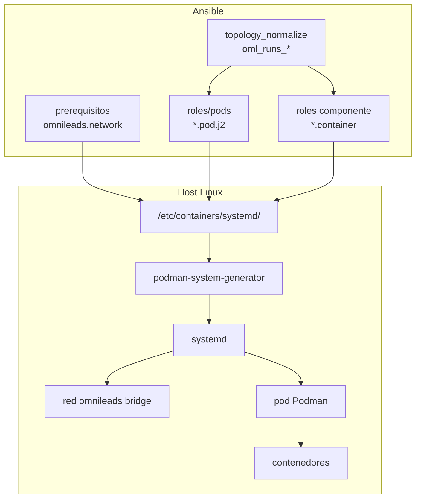
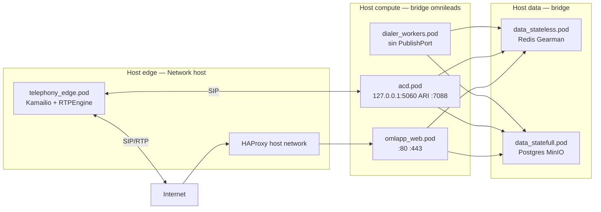

# Pods, Quadlet, contenedores y systemd en OMniLeads 3.X

Documentación operativa de cómo Ansible orquesta la plataforma con **Podman**, **Pods**, **Quadlet** y **systemd**. Cubre el modelo de red (bridge `omnileads` frente a `host` en telefonía), la publicación de puertos y el funcionamiento de los pods **dialer_workers** y **acd**.

**Roles Ansible involucrados:**

- `roles/prerequisitos` — red Podman `omnileads` (Quadlet `.network`)
- `roles/pods` — definición de pods (Quadlet `.pod`)
- `roles/dialer`, `roles/acd`, `roles/telephony_edge`, … — contenedores (Quadlet `.container` / `.service`)
- `roles/topology_normalize` — qué pods y componentes corre cada host

**Referencias en el repositorio:**

- [README.md — modelo de inventario por pods](../README.md#inventory-model)
- [README.md — modelo de red](../README.md#networking-model)
- [group_vars/all/runtime.yml](../group_vars/all/runtime.yml) — `oml_network`, puertos, unidades systemd de pods

---

## Conceptos y documentación oficial

| Concepto | Qué es en OMniLeads | Documentación oficial |
|--------|---------------------|------------------------|
| **Contenedor** | Proceso aislado (imagen OCI) que ejecuta un servicio (Asterisk, worker de dialer, Redis, etc.). | [Podman — contenedores](https://docs.podman.io/en/latest/) |
| **Pod (Podman)** | Grupo de contenedores que comparten **namespace de red** (y en la práctica, el mismo stack de red del pod). Un pod es la unidad de despliegue de red en esta arquitectura. | [podman-pod(1)](https://docs.podman.io/en/latest/markdown/podman-pod.1.html) |
| **Quadlet** | Generador de unidades systemd a partir de archivos declarativos en `/etc/containers/systemd/` (`.pod`, `.container`, `.network`). | [podman-quadlet(1)](https://docs.podman.io/en/latest/markdown/podman-quadlet.1.html), [podman-systemd.unit(5)](https://docs.podman.io/en/latest/markdown/podman-systemd.unit.5.html) |
| **systemd** | Init y supervisor: habilita servicios al arranque, reinicia contenedores, ordena dependencias (`After=`, `Wants=`). | [systemd.unit(5)](https://www.freedesktop.org/software/systemd/man/latest/systemd.unit.html) |

En este proyecto `container_orchest: systemd` ([runtime.yml](../group_vars/all/runtime.yml)): no se usa un orquestador tipo Kubernetes; **systemd es la capa de control** y Quadlet traduce los manifiestos a unidades como `dialer_workers-pod.service` o `acd-server.service`.

---

## Cómo encajan las piezas (flujo Ansible → runtime)



1. **`topology_normalize`** calcula, según los grupos del inventario (`dialer_workers`, `acd`, `edge`, …), flags como `oml_runs_dialer_workers` y endpoints (`redis_host`, `gearman_host`, `kamailio_pstn_host`, …).
2. **`prerequisitos`** despliega `omnileads.network` (driver **bridge**, nombre `omnileads`) y arranca `omnileads-network.service`.
3. **`roles/pods`** renderiza solo los `.pod` que corresponden al host (p. ej. `dialer_workers.pod`, `acd.pod`) y arranca `*-pod.service`.
4. Cada rol de componente renderiza archivos **`.container`** (Quadlet) con `Pod=<nombre>.pod`. Tras `daemon-reload`, systemd expone un servicio por contenedor (`acd-server.service`, `dialer_process_campaign@1.service`, …).
5. Los contenedores **no pueden unirse correctamente al pod** si `*-pod.service` no está activo; los handlers del proyecto reinician el **pod completo** ante cambios críticos (ver comentarios en `roles/redis/handlers/main.yml`).

El rol `pods` debe ejecutarse antes o junto con cualquier rol que declare `Pod=…` ([`pods_role_tags`](../group_vars/all/runtime.yml)); si no, systemd responde que no encuentra la unidad del pod.

---

## Inventario: un grupo → un pod (salvo excepciones)

| Grupo de inventario | Archivo Quadlet | Red del pod |
|---------------------|-----------------|-------------|
| `dialer_workers` | `dialer_workers.pod` | `omnileads` (bridge) |
| `acd` | `acd.pod` | `omnileads` (bridge) |
| `omlapp_web` | `omlapp_web.pod` | `omnileads` + `PublishPort` 80/443 |
| `edge` | `telephony_edge.pod` | **`host`** |
| *(implícito)* | `observability.pod` | `omnileads` + exporters en `omni_ip_lan` |

Co-localización: un host puede pertenecer a varios grupos y por tanto ejecutar **varios pods** a la vez (típico en AIO: `omnileads_aio`).

---

## Publicación de puertos (`PublishPort`)

En Quadlet, **`PublishPort` se declara en el archivo `.pod`**, no en cada `.container`. Podman crea el mapeo host:contenedor para **todo el pod** en la IP/puertos indicados.

Formato habitual en este proyecto:

```ini
PublishPort=<IP_en_host>:<puerto_host>:<puerto_contenedor>[/proto]
```

- **`omni_ip_lan`**: IP privada del host en la LAN del tenant; es la interfaz sobre la que se publican servicios alcanzables entre nodos del cluster (PostgreSQL, Redis, Prometheus, ARI de ACD, etc.).
- **Sin IP** (p. ej. `PublishPort=80:80` en `omlapp_web.pod`): Podman enlaza en todas las interfaces del host para esos puertos.
- **Pods sin `PublishPort`** (p. ej. `dialer_workers`, `omlapp_workers`): no exponen puertos en el host; los procesos solo hacen conexiones **salientes** hacia Redis, Gearman, PostgreSQL, APIs internas, etc.

Tras cambiar un `.pod`, Ansible reinicia `*-pod.service` para reaplicar red y portmaps ([`roles/pods/tasks/main.yml`](../roles/pods/tasks/main.yml)). En datos stateful existe un workaround adicional si el contenedor se une al pod después de creado el portmap ([`roles/postgresql/tasks/generated.yml`](../roles/postgresql/tasks/generated.yml)).

---

## Modelo de red

### Red bridge `omnileads` (casi todos los pods)

Definición:

```1:9:ansible/roles/prerequisitos/templates/omnileads.network
[Unit]
Description=OMniLeads Podman Network

[Network]
NetworkName=omnileads
Driver=bridge

[Install]
WantedBy=multi-user.target
```

Los pods de aplicación, datos y cómputo usan `Network={{ oml_network }}` con `oml_network: omnileads` ([runtime.yml](../group_vars/all/runtime.yml)).

**Comportamiento:**

- Los contenedores del mismo pod comparten red; se resuelven entre sí por nombre de contenedor en el namespace del pod.
- El tráfico hacia otros hosts del tenant usa **`omni_ip_lan`** y los puertos publicados en los pods remotos (p. ej. `redis_host:6379`, `postgres_host:5432`).
- Lo que no está en `PublishPort` **no queda escuchando en la LAN** del host, salvo tráfico originado dentro del bridge.

### Red `host` — solo telefonía VoIP en el pod edge

```1:9:ansible/roles/pods/templates/telephony_edge.pod.j2
[Unit]
StopWhenUnneeded=false
Description=OmniLeads Telephony Edge Pod 

[Pod]
Network=host

[Install]
WantedBy=multi-user.target
```

En el grupo **`edge`** viven:

- `rtpengine` — media proxy RTP
- `kamailio_webrtc` — SIP/WebRTC
- `kamailio_pstn` — SIP hacia ITSP/red telefónica

Estos contenedores necesitan **interfaces y puertos del host** (SIP UDP/TCP, RTP dinámico, posible NAT con `nat_ip_addr`, métricas en puertos locales). Por eso el pod usa `Network=host`.

**HAProxy** en edge también usa `Network=host` en su Quadlet (`.container` aparte), no dentro de `telephony_edge.pod`, pero comparte la misma filosofía: terminación TLS y enrutamiento en la frontera.

**El resto de la plataforma — incluido ACD (Asterisk) y dialer — permanece en bridge**, no en modo host.

---

## Pod `dialer_workers`

### Cuándo existe

Se despliega si el host está en el grupo `dialer_workers` o en `omnileads_aio` (`oml_runs_dialer_workers` en `topology_normalize`). El motor debe ser OMniDialer (`dialer_engine: omnidialer`).

### Definición del pod

```1:9:ansible/roles/pods/templates/dialer_workers.pod.j2
[Unit]
StopWhenUnneeded=false
Description=OmniLeads Workers Pod 

[Pod]
Network={{ oml_network }}

[Install]
WantedBy=multi-user.target
```

**Sin `PublishPort`**: los workers no ofrecen API HTTP en la LAN; consumen trabajos de **Gearman** y estado en **Redis** / **PostgreSQL** usando variables de `/etc/default/dialer.env` (`redis_host`, `gearman_host`, `postgres_host`, …).

### Contenedores en el pod

| Unidad systemd (Quadlet) | Función |
|--------------------------|---------|
| `dialer_incidence_rules.service` | Reglas de incidencia (jobs Gearman) |
| `dialer_manage_campaign.service` | Ciclo de vida de campañas |
| `dialer_scheduler.service` | Agenda (`schedule-agenda`) |
| `dialer_send_reports.service` | Informes |
| `dialer_render_template.service` | Plantillas |
| `dialer_process_campaign@N.service` | Workers de campaña (réplicas) |
| `dialer_process_contact@N.service` | Workers de contacto |
| `dialer_process_event@N.service` | Workers de eventos |

Todos declaran `Pod=dialer_workers.pod` (ejemplo):

```9:17:ansible/roles/dialer/templates/process_campaign@.container
[Container]
# Podman reemplazará el %i por el número de instancia que le pases:
ContainerName=dialer-process-campaign-%i
Image={{ DIALER_WORKER_IMG }}
Pod=dialer_workers.pod
EnvironmentFile=/etc/default/dialer.env
Environment=GEARMAN_JOBS=process-campaign
```

### API del dialer (otro pod)

La **API REST** (`dialer_api` / `flask.container`) vive en **`omlapp_web.pod`**, no en `dialer_workers`, porque comparte el tier web con Nginx y la aplicación Django. El rol `dialer` despliega API y workers en tareas separadas según `oml_has_omlapp_web` y `oml_has_dialer_workers`.

---

## Pod `acd`

### Cuándo existe

Grupo `acd` o `omnileads_aio` → `oml_runs_acd`.

### Definición del pod y puertos

```1:12:ansible/roles/pods/templates/acd.pod.j2
[Unit]
StopWhenUnneeded=false
Description=OmniLeads ACD Pod 

[Pod]
Network={{ oml_network }}

PublishPort={{ omni_ip_lan if (kamailio_pstn_out | default(false)) else '127.0.0.1' }}:5060:5060/udp
PublishPort={{ omni_ip_lan }}:{{ acd_ari_port | default(7088) }}:7088

[Install]
WantedBy=multi-user.target
```

| Puerto | Protocolo | Binding | Uso |
|--------|-----------|---------|-----|
| 5060 | UDP | `127.0.0.1` por defecto, o `omni_ip_lan` si `kamailio_pstn_out` | SIP hacia Asterisk (`acd-server`) |
| 7088 (configurable `acd_ari_port`) | TCP | `omni_ip_lan` | ARI — `acd-app` y automatizaciones en la LAN |

Con la topología habitual (Kamailio PSTN en **edge**), Asterisk recibe SIP desde el proxy en **loopback** del nodo ACD (`127.0.0.1:5060`), no desde Internet directa. ARI sí queda en LAN para integración y métricas internas.

### Contenedores en el pod

| Servicio | Contenedor | Rol |
|----------|------------|-----|
| `acd-server.service` | Asterisk | Plan de marcado, grabaciones, trunks SIP |
| `acd-app.service` | Aplicación ARI | Lógica de colas/agentes |
| `acd-config.service` | Configuración | Sincronización de config |
| `acd-fastagi.service` | FastAGI | Integración AGI |

Variables relevantes (`acd-app.env`): `ARI_URL` hacia `acd_host`, `SIP_PROXY` hacia `omni_ip_lan:kamailio_pstn_port`, Redis/Georman vía hosts inferidos por topología.

---

## Diagrama de red simplificado (cluster)



---

## Por qué este diseño de red es más seguro

1. **Superficie de exposición mínima en modo host**  
   Solo el tier **edge** (y HAProxy en ese host) usa la pila de red del host para VoIP. El resto de servicios no comparten namespace con todas las interfaces y puertos del sistema, lo que reduce el impacto de un contenedor comprometido.

2. **Publicación explícita y acotada a `omni_ip_lan`**  
   Datos y observabilidad publican en la IP LAN del tenant, no en `0.0.0.0` salvo donde el diseño lo exige (Nginx 80/443 en web). Los workers de dialer **no abren puertos** en el host: no hay endpoint atacable directamente para esos procesos.

3. **ACD y SIP no expuestos a Internet por defecto**  
   El UDP 5060 de Asterisk se enlaza a **`127.0.0.1`** salvo `kamailio_pstn_out`. El camino PSTN/WebRTC entra por **Kamailio en edge**, que actúa como SBC/proxy, no por Asterisk escuchando en WAN.

4. **Aislamiento entre pods en bridge**  
   Cada pod es un límite de red Podman; un servicio en `dialer_workers` no “ve” por defecto los puertos internos de otro pod en el mismo host sin pasar por IP publicada o rutas configuradas.

5. **Separación de funciones en cluster**  
   En inventario distribuido, Redis/Postgres/Gearman viven en hosts `data_*`; los workers solo tienen credenciales y hosts en `dialer.env`, no el binario de base de datos. Un compromiso en un worker no implica escuchar tráfico de base de datos en el mismo namespace host que RTPEngine.

6. **Operación predecible con systemd**  
   Reinicios coordinados del pod evitan estados rotos (contenedor unido a un pod caído). Eso limita errores de configuración que dejan servicios escuchando en interfaces incorrectas tras un deploy parcial.

**Trade-off consciente:** `Network=host` en edge es necesario para RTP/SIP/NAT correctos; la mitigación es **concentrar VoIP en pocos hosts**, firewall perimetral, `haproxy_prom_allowed_src`, TLS en web y variables de topología que apuntan el resto del tráfico a la LAN privada del tenant.

---

## Operación y buenas prácticas

| Acción | Comando / nota |
|--------|----------------|
| Ver pods en un host | `podman pod ps` |
| Ver unidades generadas | `systemctl list-units '*pod*'` / `systemctl status dialer_workers-pod.service` |
| Tras cambiar `.pod` o `.container` en Ansible | `daemon-reload` (lo hace el playbook) y, si cambió el `.pod`, reinicio de `*-pod.service` |
| Reinicio manual seguro | Primero `*-pod.service`, luego servicios `.container` |
| Logs | `journalctl -u acd-server.service -f` (Quadlet usa `LogDriver=journald` en la mayoría de unidades) |

**Despliegue parcial:** los tags de `pods_role_tags` incluyen `dialer`, `acd`, `telephony-edge`, etc., para que un `--tags dialer` siga recreando el pod si hace falta.

**Variables útiles:**

- `oml_network` — nombre de red bridge (default `omnileads`)
- `omni_ip_lan` — IP para `PublishPort` inter-nodo
- `kamailio_pstn_out` — enlaza SIP ACD en LAN en lugar de solo loopback
- `acd_ari_port` — puerto ARI publicado (default `7088`)

---

## Enlaces rápidos del repositorio

| Recurso | Ruta |
|---------|------|
| Plantillas de pods | `ansible/roles/pods/templates/*.pod.j2` |
| Tareas del rol pods | `ansible/roles/pods/tasks/main.yml` |
| Workers dialer | `ansible/roles/dialer/templates/*.container` |
| ACD | `ansible/roles/acd/templates/*.container` |
| Edge VoIP | `ansible/roles/telephony_edge/templates/*.container` |
| Inventario de ejemplo | `ansible/inventory.yml`, `ansible/instances/*` |
