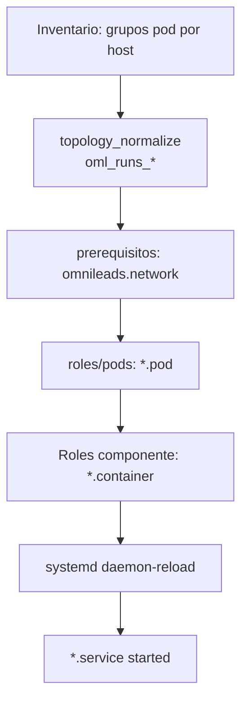

# Pods, contenedores y systemd en OMniLeads

Documentación operativa del modelo de orquestación **Podman + Quadlet + systemd** usado por Ansible para desplegar cada tenant de OMniLeads 3.X.

**Roles Ansible involucrados:**

- `roles/pods` — plantillas `.pod` y arranque de `<pod>-pod.service`
- `roles/prerequisitos` — red Podman `omnileads` (Quadlet `.network`)
- Cada rol de componente — plantillas `.container` o unidades clásicas con `podman run`

**Referencias en el repo:**

- Constantes de nombres y puertos: [`group_vars/all/runtime.yml`](../group_vars/all/runtime.yml)
- Membresía de pods por host: [`roles/topology_normalize/tasks/main.yml`](../roles/topology_normalize/tasks/main.yml)
- Utilidad operativa en el host: [`roles/prerequisitos/templates/oml_manage.sh`](../roles/prerequisitos/templates/oml_manage.sh)

---

## Visión general

OMniLeads no usa Kubernetes ni Docker Compose en producción. Cada componente es un **contenedor Podman** gestionado por **systemd**. La capa declarativa es **Quadlet**: archivos INI en `/etc/containers/systemd/` que systemd traduce a unidades `*.service`.

El agrupamiento lógico se hace con **pods de Podman** (un archivo `.pod` por pod). Los contenedores de aplicación declaran `Pod=<nombre>.pod` y comparten red de pod (salvo excepciones documentadas abajo).

```
┌─────────────────────────────────────────────────────────────────────────┐
│                         Host Linux (tenant)                             │
│                                                                         │
│  systemd                                                                │
│    ├── omnileads-network.service     ← Quadlet .network (bridge)        │
│    ├── data_statefull-pod.service    ← Quadlet .pod                     │
│    ├── postgresql.service            ← Quadlet .container → pod         │
│    ├── minio.service                 ← Quadlet .container → pod         │
│    ├── observability-pod.service                                        │
│    ├── prometheus_node_exporter.service                                 │
│    └── …                                                                │
│                                                                         │
│  Podman                                                                 │
│    ├── red: omnileads (bridge)                                          │
│    ├── pod: data_statefull.pod  → postgresql-server, minio-server       │
│    ├── pod: omlapp_web.pod      → nginx, uwsgi, daphne, websockets, …   │
│    ├── pod: enterprise.pod      → wallboard_*, bulk_messages            │
│    └── contenedores sueltos     → haproxy, promtail (host / bridge)     │
└─────────────────────────────────────────────────────────────────────────┘
```

### Glosario

| Término | Significado |
|---------|-------------|
| **Quadlet** | Generador de unidades systemd a partir de archivos declarativos en `/etc/containers/systemd/` (`.pod`, `.container`, `.network`). |
| **Pod (Podman)** | Grupo de contenedores que comparten namespace de red (y opcionalmente puertos publicados). No es un pod de Kubernetes. |
| **Unidad pod** | `systemd` expone `<stem>-pod.service` por cada `<stem>.pod` (p. ej. `omlapp_web.pod` → `omlapp_web-pod.service`). |
| **Unidad contenedor** | `<nombre>.container` → `<nombre>.service` (p. ej. `postgresql.container` → `postgresql.service`). |
| **Co-localización** | Un mismo host puede pertenecer a varios grupos del inventario (`omlapp_web` + `acd` + `dialer_workers`, etc.) y por tanto ejecutar varios pods. |
| **AIO** | Host en grupo `omnileads_aio`: todos los pods del tenant en una sola máquina. |

---

## Flujo de despliegue

1. **`topology_normalize`** (tag `always`) calcula flags `oml_runs_*` según los grupos del inventario del host (`data_statefull`, `edge`, `omlapp_web`, `omnileads_aio`, …).

2. **`prerequisitos`** despliega `omnileads.network` (driver **bridge**, nombre `omnileads`) y arranca `omnileads-network.service`.

3. **`pods`** resuelve `pods_quadlets` para el host y:
   - copia las plantillas `roles/pods/templates/<pod>.pod.j2` → `/etc/containers/systemd/<pod>.pod`;
   - ejecuta `daemon-reload`;
   - `enable` + `start` de cada `<pod>-pod.service`;
   - reinicia el pod si la plantilla `.pod` cambió.

4. **Roles de componente** despliegan `.container` (o unidades clásicas) y arrancan sus `*.service`. Muchos contenedores declaran `Requires=<pod>-pod.service` para garantizar que el pod exista antes del contenedor.

El rol `pods` debe ejecutarse **antes** que cualquier rol cuyos contenedores referencien un `.pod`; de ahí la lista amplia de tags en `pods_role_tags` en `runtime.yml`.

### Diagrama de dependencias (simplificado)



---

## Topología: qué pods corre cada host

La membresía se define en el inventario (grupos `data_statefull`, `data_stateless`, `edge`, `omlapp_web`, `omlapp_workers`, `dialer_workers`, `acd`, `callrec_processor`, `omnileads_aio`). Un host puede estar en **varios** grupos a la vez.

| Flag Ansible | Grupo inventario | Pod Quadlet |
|--------------|------------------|-------------|
| `oml_runs_data_statefull` | `data_statefull` o `omnileads_aio` | `data_statefull` |
| `oml_runs_data_stateless` | `data_stateless` o `omnileads_aio` | `data_stateless` |
| `oml_runs_edge` | `edge` o `omnileads_aio` | `telephony_edge` |
| `oml_runs_omlapp_web` | `omlapp_web` o `omnileads_aio` | `omlapp_web` |
| `oml_runs_omlapp_workers` | `omlapp_workers` o `omnileads_aio` | `omlapp_workers` |
| `oml_runs_dialer_workers` | `dialer_workers` o `omnileads_aio` | `dialer_workers` |
| `oml_runs_acd` | `acd` o `omnileads_aio` | `acd` |
| `oml_runs_callrec_processor` | `callrec_processor` o `omnileads_aio` | `callrec_processor` |
| `component_addons_enabled` | `oml_runs_omlapp_web` **y** `APP_IMG` termina en `-enterprise` | `enterprise` |
| `component_qa_enabled` | (variable, no grupo pod) | `qa` |
| observabilidad | cualquier pod de cómputo/datos/edge/voz arriba | `observability` |

El pod `observability` se despliega en **todo host** que ejecute al menos uno de los pods de la fila anterior (excepto `qa`).

Plantilla de resolución: [`roles/pods/tasks/main.yml`](../roles/pods/tasks/main.yml).

---

## Modelo de red

### Red bridge `omnileads`

Definida en [`roles/prerequisitos/templates/omnileads.network`](../roles/prerequisitos/templates/omnileads.network):

```ini
[Network]
NetworkName=omnileads
Driver=bridge
```

Variable Ansible: `oml_network: omnileads` en `runtime.yml`. Los pods internos usan `Network={{ oml_network }}`.

Los contenedores dentro del mismo pod se resuelven por **nombre DNS interno del pod** (p. ej. el exporter uWSGI apunta a `http://omlapp-uwsgi-server:9191`).

### Excepciones: `Network=host`

| Componente | Motivo |
|------------|--------|
| Pod `telephony_edge` | SIP/RTP requieren interfaces y puertos del host. |
| Pod `acd` | Asterisk trunk SIP/RTP, ARI y métricas en namespace del host; trunk en `:5070` (Kamailio PSTN en `:5060`). |
| `haproxy` | Terminación TLS y balanceo en el edge; métricas en `:8404`. |
| `survey_worker` | Worker de encuestas (plantilla legacy; no pertenece al pod `enterprise`). |
| `sentiment_analysis` | Servicio opcional de analítica de voz. |
| `nginx_certbot` | Renovación ACME puntual. |

### Publicación de puertos (`PublishPort`)

Los pods publican puertos en la IP LAN (`omni_ip_lan`) o en todas las interfaces según la plantilla. Resumen por pod en las secciones siguientes.

**Regla operativa importante:** tras un reinicio del servidor, arrancar primero la unidad del pod (`<pod>-pod.service`). Reiniciar un contenedor individual sin pod activo puede fallar en Podman 5.x.

---

## Convenciones systemd

| Archivo Quadlet | Unidad systemd generada | Ejemplo |
|-----------------|---------------------------|---------|
| `foo.pod` | `foo-pod.service` | `omlapp_web-pod.service` |
| `bar.container` | `bar.service` | `postgresql.service` |
| `baz@.container` + symlink `@N.container` | `baz@N.service` | `dialer_process_campaign@3.service` |
| `omnileads.network` | `omnileads-network.service` | — |

Algunos contenedores usan nombre de unidad distinto al del fichero:

| Fichero | Unidad systemd | Contenedor |
|---------|----------------|------------|
| `omnileads.container` | `omnileads.service` | `omlapp-uwsgi` |
| `dialer_api.container` | `dialer_api.service` | `dialer-api` |
| `django.service` (legacy path) | — | desplegado como `omnileads.container` |

Variables de entorno runtime viven en `/etc/default/*.env` (p. ej. `django.env`, `acd.env`, `dialer.env`). Los logs van a **journald** (`LogDriver=journald` en Quadlet).

---

## Pods y contenedores (detalle)

### 1. `data_statefull` — datos persistentes

| | |
|---|---|
| **Plantilla** | `roles/pods/templates/data_statefull.pod.j2` |
| **Unidad systemd** | `data_statefull-pod.service` |
| **Red** | `omnileads` (bridge) |
| **Puertos publicados** | `omni_ip_lan:5432`, `:9000`, `:9001` |
| **Hosts** | `data_statefull`, `omnileads_aio` |

| Unidad systemd | Contenedor | Imagen (rol) | Función |
|----------------|------------|--------------|---------|
| `postgresql.service` | `postgresql-server` | `POSTGRES_IMG` | Base PostgreSQL del tenant (OML + esquema dialer). |
| `minio.service` | `minio-server` | `MINIO_IMG` | Almacenamiento S3-compatible (grabaciones, estáticos, etc.). |

Dependencia: `postgresql.service` declara `Requires=data_statefull-pod.service`.

---

### 2. `data_stateless` — datos volátiles / colas

| | |
|---|---|
| **Plantilla** | `roles/pods/templates/data_stateless.pod.j2` |
| **Unidad systemd** | `data_stateless-pod.service` |
| **Red** | `omnileads` |
| **Puertos publicados** | `omni_ip_lan:6379`, `:4730` |
| **Hosts** | `data_stateless`, `omnileads_aio` |

| Unidad systemd | Contenedor | Imagen | Función |
|----------------|------------|--------|---------|
| `redis.service` | `redis-server` | `REDIS_IMG` | Cache, sesiones, pub/sub. |
| `gearman.service` | `gearman-server` | `GEARMAN_IMG` | Cola de trabajos para dialer y workers. |

---

### 3. `telephony_edge` — borde SIP/WebRTC

| | |
|---|---|
| **Plantilla** | `roles/pods/templates/telephony_edge.pod.j2` |
| **Unidad systemd** | `telephony_edge-pod.service` |
| **Red** | **`host`** (sin bridge) |
| **Puertos publicados** | Ninguno en el `.pod` (los procesos enlazan directamente al host) |
| **Hosts** | `edge`, `omnileads_aio` |

| Unidad systemd | Contenedor | Imagen | Función |
|----------------|------------|--------|---------|
| `kamailio_webrtc.service` | `kamailio-webrtc` | `KAMAILIO_IMG` | Proxy SIP/WSS para agentes WebRTC. Métricas `:9274`. |
| `kamailio_pstn.service` | `kamailio-pstn-server` | `KAMAILIO_IMG` | Proxy SIP hacia trunks PSTN. Métricas `:9273`. HEP hacia Homer si está configurado. |
| `rtpengine.service` | `rtpengine-server` | `RTPENGINE_IMG` | Media relay RTP/SRTP. Métricas `:22223`. |

**Nota:** `haproxy` corre en el host edge pero **fuera** de este pod (`Network=host`, sin `Pod=`).

**WSS agentes (cluster):** el navegador abre `wss://<fqdn>/ws` en `:443`. HAProxy termina TLS y reenvía `GET /ws` a `kamailio-webrtc` en `omni_ip_lan:10060` (sin pasar por nginx en `omlapp_web`). En AIO sin HAProxy, nginx en `:443` hace el proxy `/ws` hacia Kamailio.

**Upgrade (`--action=upgrade`):** cambios en `kamailio_pstn.env` / `kamailio_webrtc.env` (p. ej. `acd_nodes` con `:5070`, `ACD_NET_ADDR`) disparan reinit de `telephony_edge-pod.service` en el rol `telephony_edge` antes de arrancar contenedores.

---

### 4. `omlapp_web` — capa web y API dialer

| | |
|---|---|
| **Plantilla** | `roles/pods/templates/omlapp_web.pod.j2` |
| **Unidad systemd** | `omlapp_web-pod.service` |
| **Red** | `omnileads` |
| **Puertos publicados** | `80`, `443` (todas las interfaces), `omni_ip_lan:9191` (stats uWSGI) |
| **Hosts** | `omlapp_web`, `omnileads_aio` |

| Unidad systemd | Contenedor | Imagen | Función |
|----------------|------------|--------|---------|
| `omnileads.service` | `omlapp-uwsgi` | `APP_IMG` | Django vía uWSGI (aplicación principal). |
| `daphne.service` | `omlapp-daphne` | `APP_IMG` | ASGI / canales Django (tiempo real). |
| `websockets.service` | `websocket-server` | `WS_IMG` | Servidor WebSocket OMniLeads (`:8000` interno). |
| `nginx.service` | `nginx-server` | `NGINX_IMG` | Reverse proxy TLS, estáticos, upstream hacia uWSGI/Daphne/WS. |
| `dialer_api.service` | `dialer-api` | `DIALER_API_IMG` | API REST Omnidialer (Flask). |

Varios servicios declaran `Requires=omlapp_web-pod.service`.

---

### 5. `omlapp_workers` — workers de aplicación Django

| | |
|---|---|
| **Plantilla** | `roles/pods/templates/omlapp_workers.pod.j2` |
| **Unidad systemd** | `omlapp_workers-pod.service` |
| **Red** | `omnileads` |
| **Puertos publicados** | Ninguno |
| **Hosts** | `omlapp_workers`, `omnileads_aio` |

| Unidad systemd | Contenedor | Imagen | Función |
|----------------|------------|--------|---------|
| `whatsapp.service` | `omlapp-whatsapp` | `APP_IMG` | Integración WhatsApp (si está habilitada). |
| `call_logger.service` | `oml-call-logger` | `APP_IMG` | Registro de llamadas en background. |
| `background_dialer_tasks.service` | `omlapp-dialer-worker` | `APP_IMG` | Listener de eventos Omnidialer (`omnidialer_events_listener`). |
| `background_callrec_tasks.service` | `omlapp-callrec-worker` | `APP_IMG` | Tareas background de grabaciones. |
| `dashboard_agent_scheduler.service` | `omlapp-dashboard-agent-scheduler` | `APP_IMG` | Scheduler del dashboard de agentes. |
| `supervision_agentes_scheduler.service` | `omlapp-supervision-agentes-scheduler` | `APP_IMG` | Scheduler de supervisión de agentes. |
| `supervision_events_listener.service` | `omlapp-supervision-events-listener` | `APP_IMG` | Listener de eventos de supervisión. |
| `presence_heartbeat_scheduler.service` | `omlapp-presence-heartbeat-scheduler` | `APP_IMG` | Heartbeat de presencia de agentes. |
| `daily_redis_cleanup.service` | `omlapp-daily-redis-cleanup` | `APP_IMG` | Limpieza programada de claves Redis. |

Todos usan `EnvironmentFile=/etc/default/django.env` salvo casos específicos del rol.

---

### 6. `dialer_workers` — workers Omnidialer (Gearman)

| | |
|---|---|
| **Plantilla** | `roles/pods/templates/dialer_workers.pod.j2` |
| **Unidad systemd** | `dialer_workers-pod.service` |
| **Red** | `omnileads` |
| **Puertos publicados** | Ninguno |
| **Hosts** | `dialer_workers`, `omnileads_aio` |

| Unidad systemd | Contenedor | Imagen | Función |
|----------------|------------|--------|---------|
| `dialer_manage_campaign.service` | `dialer-manage-campaign` | `DIALER_WORKER_IMG` | Gestión de campañas salientes. |
| `dialer_incidence_rules.service` | `dialer-incidence-rules` | `DIALER_WORKER_IMG` | Reglas de incidencias del dialer. |
| `dialer_render_template.service` | `dialer-render-template` | `DIALER_WORKER_IMG` | Renderizado de plantillas de campaña. |
| `dialer_scheduler.service` | `dialer-scheduler` | `DIALER_WORKER_IMG` | Job Gearman `schedule-agenda` + encola auditoría periódica. |
| `dialer_channel_audit.service` | `dialer-channel-audit` | `DIALER_WORKER_IMG` | Job Gearman `audit-active-channels` (reconcilia `OML:CALLS`). |
| `dialer_send_reports.service` | `dialer-send-reports` | `DIALER_WORKER_IMG` | Envío de reportes de campaña. |
| `dialer_process_campaign@N.service` | `dialer-process-campaign-N` | `DIALER_WORKER_IMG` | Workers de procesamiento de campaña (réplicas). |
| `dialer_process_contact@N.service` | `dialer-process-contact-N` | `DIALER_WORKER_IMG` | Workers de contactos (plantilla `@`, réplicas vía inventario). |
| `dialer_process_event@N.service` | `dialer-process-event-N` | `DIALER_WORKER_IMG` | Workers de eventos (plantilla `@`). |

**Réplicas:** controladas por variables de inventario (`dialer_process_campaign_replicas`, `dialer_process_contact_replicas`, `dialer_process_event_replicas`; defaults en `tenants_global.yml`: campaña **5**, contacto/evento **1**). Ansible crea symlinks `dialer_process_campaign@N.container` → `@.container` y arranca `dialer_process_campaign@N.service`.

La API (`dialer-api`) vive en el pod **`omlapp_web`**, no aquí.

---

### 7. `acd` — telefonía ACD (Asterisk)

| | |
|---|---|
| **Plantilla** | `roles/pods/templates/acd.pod.j2` |
| **Unidad systemd** | `acd-pod.service` |
| **Red** | `host` |
| **Puertos en el host** | Trunk SIP UDP `:5070` (`acd_trunk_sip_port`), agentes WebRTC `:5160`, ARI `:7088`, métricas app `:7098` |
| **Hosts** | `acd`, `omnileads_aio` |

| Unidad systemd | Contenedor | Imagen | Función |
|----------------|------------|--------|---------|
| `acd-config.service` | `acd-conf` | `ACD_IMG` | Generación/sincronización de configuración Asterisk (`retrieve_conf`). |
| `acd-server.service` | `acd-server` | `ACD_IMG` | Daemon Asterisk (colas, dialplan, RTP PSTN). |
| `acd-app.service` | `acd-app` | `ACD_IMG` | ARI Stasis app (lógica de colas OMniLeads). |
| `acd-fastagi.service` | `acd-fastagi` | `FASTAGI_IMG` | FastAGI para scripts de dialplan (`:4573` hacia el pod). |

Orden típico: `acd-config` → `acd-server` → `acd-app` / `acd-fastagi`.

**Upgrade (`--action=upgrade`):** si cambia `acd.pod` (p. ej. migración bridge → `Network=host`), el rol `pods` hace tear-down y recrea la infra Podman antes de que el rol `acd` aplique env vars y reinicie `acd-pod.service`. Coordinar con `telephony_edge` en el mismo upgrade: `kamailio_pstn.env` (`acd_nodes` con `:5070`) y `kamailio_webrtc.env` (`ACD_NET_ADDR`) deben desplegarse en el mismo ciclo. Requiere imagen `ACD_IMG` con trunk PJSIP en `acd_trunk_sip_port` (default `:5070`).

---

### 8. `callrec_processor` — post-procesado de grabaciones

| | |
|---|---|
| **Plantilla** | `roles/pods/templates/callrec_processor.pod.j2` |
| **Unidad systemd** | `callrec_processor-pod.service` |
| **Red** | `omnileads` |
| **Puertos publicados** | Ninguno |
| **Hosts** | `callrec_processor`, `omnileads_aio` |

| Unidad systemd | Contenedor | Imagen | Función |
|----------------|------------|--------|---------|
| `callrec_compressor.service` | `callrec-compressor` | `CALLREC_COMPRESSOR_IMG` | Compresión/conversión de grabaciones (p. ej. a MP3). |
| `callrec_transcriber.service` | `callrec-transcriptor` | `CALLREC_TRANSCRIBER_IMG` | Transcripción de audio (si está habilitada). |

---

### 9. `enterprise` — addons Enterprise (wallboard, bulk messages)

| | |
|---|---|
| **Plantilla** | `roles/pods/templates/enterprise.pod.j2` |
| **Unidad systemd** | `enterprise-pod.service` |
| **Red** | `omnileads` |
| **Puertos publicados** | Ninguno |
| **Hosts** | `omlapp_web`, `omnileads_aio` cuando `APP_IMG` termina en `-enterprise` (`component_addons_enabled`) |

| Unidad systemd | Contenedor | Imagen | Función |
|----------------|------------|--------|---------|
| `wallboard_listener.service` | `oml-wallboard-server` | `APP_IMG` | Listener de eventos wallboard. |
| `wallboard_worker.service` | `oml-wallboard-worker` | `APP_IMG` | Actualización de widgets inertes del wallboard. |
| `bulk_messages.service` | `oml-bulk-messages-worker` | `APP_IMG` | Envío masivo de mensajes. |

Rol Ansible: [`roles/addons`](../roles/addons/). Sin tag `-enterprise` en `APP_IMG`, no se crea el pod ni se ejecuta el rol.

---

### 10. `observability` — métricas locales

| | |
|---|---|
| **Plantilla** | `roles/pods/templates/observability.pod.j2` |
| **Unidad systemd** | `observability-pod.service` |
| **Red** | `omnileads` |
| **Puertos publicados** | Condicionales por rol del host (ver tabla abajo) |
| **Hosts** | Todo host con pods de datos, edge, web, workers, dialer, acd o callrec |

| Puerto | Contenedor / unidad | Presente en |
|--------|---------------------|-------------|
| `:9100` | `obs-prometheus-node-exporter` / `prometheus_node_exporter.service` | Todos |
| `:9882` | `obs-prometheus-podman-exporter` / `prometheus_podman_exporter.service` | Todos |
| `:9090` | `obs-prometheus-server` / `prometheus.service` | `omlapp_web`, AIO |
| `:9117` | `obs-prometheus-uwsgi` / `prometheus_uwsgi.service` | `omlapp_web`, AIO |
| `:9187` | `obs-prometheus-postgres` / `prometheus_postgres.service` | `data_statefull`, AIO |
| `:9121` | `obs-prometheus-redis` / `prometheus_redis.service` | `data_stateless`, AIO |
| `:9418` | `obs-prometheus-gearman` / `prometheus_gearman.service` | `data_stateless`, AIO |

Documentación ampliada de scrape, Loki y Homer: [`observability.md`](observability.md).

**Promtail** (`obs-promtail`, unidad `promtail.service`) usa la red `omnileads` pero **no** pertenece al pod `observability`; es un contenedor Quadlet independiente que lee journald y envía logs a Loki.

---

### 11. `qa` — entorno de pruebas PSTN (opcional)

| | |
|---|---|
| **Plantilla** | `roles/pods/templates/qa.pod.j2` |
| **Unidad systemd** | `qa-pod.service` |
| **Red** | `omnileads` |
| **Puertos publicados** | `omni_ip_lan:4569/udp`, `:8808` |
| **Hosts** | Cuando `component_qa_enabled: true` |

| Unidad systemd | Contenedor | Imagen | Función |
|----------------|------------|--------|---------|
| `pstn.service` | `oml-pstn-server` | imagen QA PSTN | Simulador PSTN / Asterisk de prueba (SIP, `sipp`). |
| `nginx_qa.service` | `oml-nginx_qa-server` | `NGINX_IMG` | Nginx auxiliar para escenarios QA. |

---

## Contenedores fuera de pods

Estos servicios **no** declaran `Pod=`; conviene tratarlos aparte en operaciones y diagramas de red.

| Unidad | Contenedor | Red | Rol / función |
|--------|------------|-----|----------------|
| `haproxy.service` | `haproxy` | `host` | Balanceador edge (`/prom`, Web, `wss://<fqdn>/ws` → kamailio-webrtc `:10060`). |
| `promtail.service` | `obs-promtail` | `omnileads` | Envío de logs journald → Loki. |
| `traefik.service` | `traefik-lb` | Quadlet con `PublishPort` propio | Alternativa a HAProxy (rol `traefik_lb`). |
| `survey_worker.service` | `oml-survey_worker-server` | `host` | Encuestas post-llamada (plantilla legacy). |
| `sentiment_analysis.service` | `oml-sentiment_analysis-server` | `host` | Analítica de sentimiento (opcional). |
| `nginx_certbot.service` | `oml-nginx-certbot-server` | `host` | Renovación certificados Let's Encrypt. |

---

## Operación en el host

### Comandos systemd habituales

```bash
# Estado del pod web
systemctl status omlapp_web-pod.service

# Reiniciar un contenedor
systemctl restart nginx.service

# Tras editar un .container o .pod manualmente
sudo systemctl daemon-reload
```

### `oml_manage`

Script instalado por `prerequisitos` (`/usr/local/bin/oml_manage` o ruta del rol). Comandos relevantes:

```bash
oml_manage status                   # contenedores conocidos + stats
oml_manage health                   # postgres, redis, minio, omlapp, nginx, acd
oml_manage stack-up                 # arranca unidades en orden de dependencia
oml_manage pod-restart omlapp_web   # reinicia omlapp_web-pod.service
oml_manage restart acd              # reinicia acd-pod.service (pod conocido)
```

Pods reconocidos por `oml_manage`: `acd`, `callrec_processor`, `data_statefull`, `data_stateless`, `dialer_workers`, `observability`, `omlapp_web`, `omlapp_workers`, `telephony_edge`.

### Orden de arranque recomendado

1. `omnileads-network.service`
2. Unidades `*-pod.service` de los pods del host
3. Datos: `postgresql`, `redis`, `minio`, `gearman`
4. Aplicación: `omnileads`, `daphne`, `websockets`, `nginx`
5. Voz: `acd-*`, `kamailio_*`, `rtpengine`
6. Dialer workers y observabilidad

`oml_manage stack-up` implementa un subconjunto de este orden en `STACK_UNITS_ORDER`.

### Logs

```bash
# Logs de un contenedor vía journald
journalctl -u nginx.service -f

# O directamente Podman
oml_manage logs -f nginx-server
```

Promtail etiqueta streams con `tenant`, `service` y `node_type` para Loki.

---

## Resumen por despliegue

### AIO (un solo host)

Todos los pods anteriores (salvo `qa` si no está habilitado) coexisten en `omnileads_aio`. `omni_ip_lan` concentra servicios de datos; el edge telefónico comparte el mismo kernel con `Network=host` en `telephony_edge` y HAProxy.

### Cluster (hosts separados)

Cada fila de la tabla de topología puede mapearse a un host distinto. Los contenedores alcanzan peers por **`omni_ip_lan`** del host remoto (PostgreSQL, Redis, MinIO, Gearman, scrape Prometheus, etc.). El rol `topology_normalize` resuelve `data_host`, `edge_host`, `aio_host` para plantillas de `.env`.

---

## Diagrama de pods en cluster típico

```
                    ┌──────────────── edge ───────────────┐
                    │ telephony_edge.pod                  │
                    │  kamailio-webrtc, kamailio-pstn,    │
                    │  rtpengine                          │
                    │ haproxy (host, suelto)              │
                    │ observability.pod (exporters)       │
                    └─────────────────────────────────────┘
                                      │
     ┌──────────────── data_statefull ─────────────┐   ┌── data_stateless ──┐
     │ postgresql-server, minio-server             │   │ redis, gearman     │
     │ observability.pod (postgres exporter)       │   │ observability.pod  │
     └─────────────────────────────────────────────┘   └────────────────────┘

     ┌──────────────── omlapp_web ───────────────────────────────────────────┐
     │ nginx, omlapp-uwsgi, omlapp-daphne, websocket-server, dialer-api      │
     │ observability.pod (prometheus, uwsgi exporter, node/podman exporters) │
     └───────────────────────────────────────────────────────────────────────┘

     ┌─ omlapp_workers -─┐  ┌─ dialer_workers ────────┐  ┌─ acd ──────────────┐
     │ workers Django    │  │ dialer-* workers        │  │ acd-server, app,   │
     │ observability.pod │  │ observability.pod       │  │ conf, fastagi      │
     └───────────────────┘  └─────────────────────────┘  │ observability.pod  │
                                                         └──────────────────--┘

     ┌─ callrec_processor ────────────────────-─┐
     │ callrec-compressor, callrec-transcriptor │
     │ observability.pod                        │
     └──────────────────────────────────────────┘
```

---

## Referencias

- README general (Quadlet, firewall, imágenes): [`README.md`](../README.md#podman-systemd)
- Observabilidad (Prometheus, Promtail, Loki): [`observability.md`](observability.md)
- Inventario y grupos pod: [`README.md`](../README.md#inventory-model)
- Changelog migración host → bridge: [`changelog.md`](../changelog.md)
