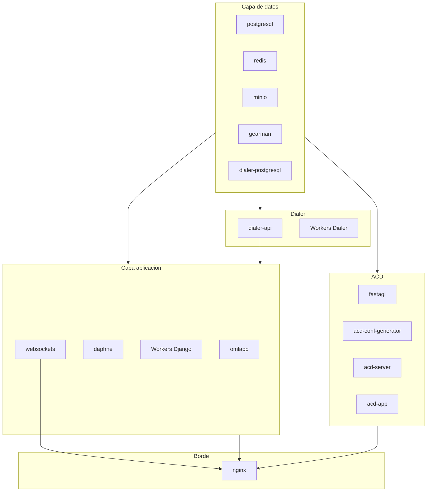

# Documentación del stack de despliegue

Este documento describe la función de cada servicio del stack definido en `docker-compose.yml` para el entorno de test. El stack corresponde a **OmniLeads** (contact center) junto con **OmniDialer** y los componentes de telefonía (SIP, WebRTC, ACD). Las variables de entorno, hosts y puertos se configuran en el archivo `.env` del mismo directorio.

---

## Servicios de backend

| Servicio | Función |
|----------|---------|
| **postgresql** | Base de datos principal de OmniLeads. Almacena configuración, usuarios, campañas, reportes y datos de llamadas. |
| **redis** | Cache, sesiones y pub/sub; incluye RedisGears. Usado por la aplicación web, workers, websockets y el ACD para estado en tiempo real y colas. |
| **minio** | Almacenamiento de objetos compatible con S3. Guarda grabaciones de llamadas y archivos media. API en el puerto 9000 y consola web en 9001. |
| **createbuckets** | Tarea one-shot que crea el bucket `omnileads` y el usuario `omlminio` en MinIO. Se ejecuta una vez al levantar el stack. |
| **gearman** | Cola de trabajos distribuidos. Usado por el ACD (registro de llamadas), el dialer (campañas, contactos, eventos) y el procesamiento post-llamada. |
| **dialer-postgresql** | Base de datos del OmniDialer. Puerto 5433, inicializada con `omnidialer.sql`. Almacena campañas, contactos y métricas del dialer. |

---

## Aplicación Django

| Servicio | Función |
|----------|---------|
| **omlapp** | Aplicación web principal (uWSGI). Expone la interfaz de usuario y las APIs REST de OmniLeads. |
| **daphne** | Servidor ASGI para peticiones asíncronas y WebSockets (Django Channels). Atiende canales y conexiones en tiempo real. |
| **supervision-events-listener** | Escucha eventos de supervisión y los procesa para actualizar estado y reportes. |
| **whatsapp** | Worker de integración con WhatsApp; procesa mensajes y eventos del canal. |
| **background-tasks** | Worker de tareas en segundo plano (emails, reportes, etc.). |
| **presence-heartbeat-scheduler** | Programador de heartbeats de presencia de agentes para el dashboard en tiempo real. |
| **daily-redis-cleanup** | Limpieza diaria de datos temporales en Redis. |
| **background-dialer-tasks** | Listener de eventos del dialer (`omnidialer_events_listener`); sincroniza estado entre Django y OmniDialer. |
| **dashboard-agent-scheduler** | Actualización programada del reporte del día actual por agente. |
| **supervision-agentes-scheduler** | Actualización programada de reportes de supervisores. |
| **django-commands** | Perfil opcional para ejecutar comandos Django (por ejemplo, migraciones o tareas administrativas). No se levanta por defecto. |

---

## WebSocket y servidor web

| Servicio | Función |
|----------|---------|
| **websockets** | Servidor WebSocket dedicado para tiempo real: presencia, notificaciones y actualizaciones en vivo en la web. |
| **nginx** | Reverse proxy HTTPS (puerto 443). Sirve estáticos, reparte tráfico a omlapp (WSGI), daphne (ASGI), websockets y Kamailio WebRTC. Punto de entrada único desde el exterior. |

---

## Telefonía (SIP/RTP)

| Servicio | Función |
|----------|---------|
| **kamailio-webrtc** | Proxy SIP para clientes WebRTC: registro de extensiones, autenticación y enrutamiento hacia Asterisk. |
| **rtpengine** | Media proxy RTP/SRTP. Intermedia el tráfico de audio/video entre WebRTC y RTP clásico (Asterisk, troncales). |

---

## ACD (Asterisk)

| Servicio | Función |
|----------|---------|
| **fastagi** | Servicio FastAGI que Asterisk consulta para lógica de llamadas (AMD, enrutamiento, etc.). Conecta con PostgreSQL, Redis y Gearman. |
| **acd-conf-generator** | Genera la configuración de Asterisk (astconf) desde los datos de OmniLeads; escribe en el volumen compartido que usa el ACD. |
| **acd-server** | Asterisk como PBX/ACD. Gestiona llamadas, colas y grabaciones; estas se almacenan en el volumen `asterisk_callrec`. |
| **acd-app** | Aplicación ARI (Asterisk REST Interface). Orquesta las llamadas en Asterisk vía Stasis (transferencias, grabación, integración con el dialer). |

---

## Procesamiento post-llamada

| Servicio | Función |
|----------|---------|
| **call-logger** | Worker Gearman que recibe eventos de llamadas y los persiste en la base de datos principal (duración, disposición, etc.). |
| **callrec-compressor** | Comprime las grabaciones generadas por Asterisk y las sube al bucket S3/MinIO. Lee desde el volumen compartido de grabaciones. |

*Servicio opcional no incluido por defecto: `callrec-transcriber` (transcripción de grabaciones con STT).*

---

## Dialer (OmniDialer)

| Servicio | Función |
|----------|---------|
| **dialer-api** | API del dialer (puerto 1440). Recibe órdenes desde Django para crear, pausar, reanudar o detener campañas y gestionar contactos. |
| **dialer-process-contact** | Worker Gearman: procesamiento de contactos (marcado, resultado, reagenda). |
| **dialer-process-camp** | Worker Gearman: procesamiento de campañas (estado, progreso). |
| **dialer-process-event** | Worker Gearman: procesamiento de eventos del dialer. |
| **dialer-scheduler** | Worker Gearman: programación de la agenda de contactos (schedule-agenda). |
| **dialer-start-camp** | Worker Gearman: inicio de campañas. |
| **dialer-create-camp** | Worker Gearman: creación de campañas. |
| **dialer-resume-camp** | Worker Gearman: reanudación de campañas pausadas. |
| **dialer-edit-camp** | Worker Gearman: edición de campañas. |
| **dialer-stop-camp** | Worker Gearman: detención de campañas. |
| **dialer-pause-camp** | Worker Gearman: pausa de campañas. |
| **dialer-delete-camp** | Worker Gearman: eliminación de campañas. |
| **dialer-change-database-camp** | Worker Gearman: cambio de base de contactos de una campaña. |
| **dialer-send-reports** | Worker Gearman: envío de reportes del dialer. |
| **dialer-add-incidence-rule** | Worker Gearman: alta de reglas de incidencia por disposición. |
| **dialer-create-incidence-rule** | Worker Gearman: creación de reglas de incidencia. |
| **dialer-delete-incidence-rule** | Worker Gearman: eliminación de reglas de incidencia. |
| **dialer-update-incidence-rule** | Worker Gearman: actualización de reglas de incidencia. |
| **dialer-render-template** | Worker Gearman: renderizado de plantillas (por ejemplo, para reportes). |
| **dialer-manage-dialer** | Worker Gearman: tareas de gestión general del dialer. |

---

## Servicios opcionales

| Servicio | Función |
|----------|---------|
| **pbxemulator** | Emulador PSTN para QA. Simula respuestas de llamadas (contestadas, ocupado, congestión, etc.) según `PSTN_EMULATOR_MODE`. |
| **redisinsight** | Interfaz web para inspeccionar y administrar Redis (puerto 7963). |
| **pgadmin** | Interfaz web para administrar PostgreSQL (base principal y dialer-postgresql). Puerto configurable vía `PGADMIN_EXT_PORT`. |

*En el compose hay servicios comentados como `kamailio-pstn` (proxy SIP para PSTN) y `callrec-transcriber`; se pueden habilitar según necesidad.*

---

## Diagrama de dependencias (alto nivel)



---

## Configuración y despliegue

Las variables de entorno, hosts y puertos se definen en el archivo `.env` de este directorio. Para desplegar el stack:

```bash
docker compose -f docker-compose/test-env/docker-compose.yml --env-file docker-compose/test-env/.env up -d
```

Para incluir servicios opcionales (por ejemplo `pgadmin`, `redisinsight` o `pbxemulator`), hay que asegurarse de que estén definidos en el compose sin `profiles` que los excluyan, o usar el perfil correspondiente si se ha configurado.
