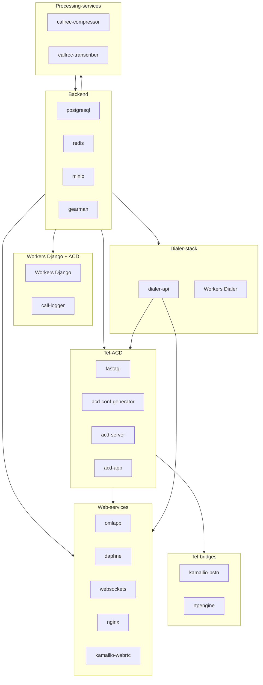

# Documentación del stack de despliegue

Este documento describe la función de cada servicio del stack de OMniLeads desplegado con Docker Compose y cómo adaptar el despliegue a distintos escenarios mediante el archivo `.env`.

El modelo es de **stack único**: la plantilla `docker-compose-template.yml` define **todos** los componentes — **OMniLeads** (contact center) + **OMniDialer** + telefonía (SIP, WebRTC, ACD) + herramientas de QA/desarrollo. Ya no existen los entornos `test-env` / `dev-env` / `prod-env`: el mismo stack funciona para **desarrollo**, **producción**, con **edge server externo** o con **data server externo**, según los valores que se configuren en el `.env`.

## Descarga y despliegue con curl

No hace falta clonar el repositorio a mano: `deploy.sh` se descarga directamente y se encarga de todo — clona/actualiza `omldeploytool` en la rama indicada, inicializa los submódulos, genera `docker-compose.yml` y `.env` desde las plantillas y construye las imágenes.


```bash
# Elegir la rama a desplegar
RAMA=develop-3.0
curl -fsSL "https://gitlab.com/omnileads/omldeploytool/-/raw/${RAMA}/docker-compose/docker_install_linux.sh" -o docker_install_linux.sh
bash docker_install_linux.sh
```

```bash
# Elegir la rama a desplegar
RAMA=develop-3.0
curl -fsSL "https://gitlab.com/omnileads/omldeploytool/-/raw/${RAMA}/docker-compose/deploy.sh" -o deploy.sh
bash deploy.sh "$RAMA"
```

Si GitLab no está disponible, se puede usar el mirror de GitHub:

```bash
curl -fsSL "https://raw.githubusercontent.com/Freetech-Solutions/omldeploytool/${RAMA}/docker-compose/deploy.sh" -o deploy.sh
chmod +x deploy.sh
./deploy.sh --repo=github.com/Freetech-Solutions "$RAMA"
```

Al finalizar, el stack queda listo en `./omldeploytool/docker-compose/`:

```bash
cd omldeploytool/docker-compose
./oml_manage.sh up -d
./oml_manage.sh reset-pass      # admin / admin
```

> Requiere que `deploy.sh` esté pusheado en la rama elegida. Opciones útiles: `./deploy.sh --no-build` (sin build de imágenes), `--path=/srv/` (directorio destino del clone). Ver `./deploy.sh --help`.

## Archivos involucrados

| Archivo | Rol |
|---------|-----|
| `docker-compose-template.yml` | Plantilla versionada con todos los componentes. |
| `docker-compose.yml` | Copia de trabajo que usa Compose (gitignored). |
| `env` | Plantilla de variables con todos los valores y comentarios. |
| `.env` | Copia de trabajo de variables (gitignored). |

## Inicio rápido

```bash
cd docker-compose
cp docker-compose-template.yml docker-compose.yml
cp env .env
# editar .env según el escenario (ver "Modos de despliegue")
./oml_manage.sh up -d
./oml_manage.sh reset-pass      # admin / admin
./oml_manage.sh data-generate   # datos de demo (opcional)
```

---

## Backend

Servicios de datos e infraestructura compartida: bases de datos, caché, almacenamiento de objetos y cola de trabajos.

| Servicio | Función |
|----------|---------|
| **postgresql** | Instancia única de PostgreSQL (puerto 5432). Contiene la DB `omnileads` (OML) y la DB `omnidialer` (dialer), creada al init con `omnidialer.sql` — el mismo patrón que el rol Ansible `postgresql`. |
| **redis** | Cache, sesiones, pub/sub y colas en tiempo real (con RedisGears). Usado por la web, los workers, los websockets y el ACD. |
| **minio** | Almacenamiento de objetos compatible con S3 para grabaciones y archivos media. API en `:9000` y consola en `:9001`. Con límites de recursos (`1G` / `0.5 CPU`). |
| **createbuckets** | Tarea one-shot (`restart: "no"`) que, al levantar el stack, crea el bucket `omnileads`, el usuario `omlminio` y asigna la política `readwrite`. |
| **gearman** | Cola de trabajos distribuidos. La usan el ACD (registro de llamadas), el dialer (campañas/contactos/eventos) y los procesos post-llamada. |

---

## Tel-ACD (Asterisk / ACD)

Componentes del *Automatic Call Distribution*: Asterisk como PBX/ACD, generación de configuración, FastAGI y aplicación ARI.

| Servicio | Función |
|----------|---------|
| **fastagi** | Servicio FastAGI consultado por Asterisk para lógica de llamadas (AMD, enrutamiento, etc.). Conecta con PostgreSQL, Redis y Gearman. |
| **acd-conf-generator** | Genera la configuración de Asterisk (`astconf.py`) a partir de los datos de OMniLeads y la escribe en el volumen compartido `asterisk_conf`. |
| **acd-server** | Asterisk como PBX/ACD. Gestiona llamadas, colas y grabaciones (volúmenes `asterisk_callrec`, `asterisk_conf`, `asterisk_sounds`). Recibe una IP fija (`ACD_HOST_IP`) dentro de la red `omnileads`. |
| **acd-app** | Aplicación ARI (Asterisk REST Interface) que orquesta llamadas en Asterisk vía Stasis: transferencias, grabación, integración con el dialer y con la API REST de OMniLeads. |

---

## Tel-bridges (puentes SIP/RTP)

Proxy SIP para PSTN y media proxy RTP. Usan la red bridge `omnileads` con IPs estáticas (Kamailio dispatcher/allowlist y PJSIP identify matchean por IP origen, no por DNS). Si se usa un **edge server externo**, estos contenedores locales dejan de ser necesarios (ver *Modos de despliegue*).

| Servicio | Función |
|----------|---------|
| **kamailio-pstn** | Proxy SIP para tráfico PSTN. Enruta llamadas entrantes/salientes hacia el ACD y se apoya en `rtpengine` para el media. Usa la trunk hacia los ITSPs definidos en `KAMAILIO_ITSP_NODES`. IP fija `KAMAILIO_PSTN_IP`. |
| **rtpengine** | Media proxy RTP/SRTP. Intermedia el tráfico de audio/video entre WebRTC (SRTP) y RTP clásico (Asterisk, troncales). Rango de puertos `RTPENGINE_RTP_PORT_MIN` – `RTPENGINE_RTP_PORT_MAX`. |

---

## Web-services

Servidor web, aplicación Django (uWSGI/ASGI), WebSockets y proxy SIP WebRTC. Punto de entrada HTTP/HTTPS y de conexiones en tiempo real.

| Servicio | Función |
|----------|---------|
| **omlapp** | Aplicación web principal (uWSGI). Expone la UI y las APIs REST de OMniLeads. Healthcheck contra `:8099/`. El entrypoint lo define `DJANGO_ENTRYPOINT` (`init_devenv.sh` para desarrollo, `init_uwsgi.sh` para producción) y monta el código fuente desde `${REPO_PATH}/django/`. |
| **daphne** | Servidor ASGI para peticiones asíncronas y WebSockets de Django Channels. Atiende canales y conexiones en tiempo real. |
| **websockets** | Servidor WebSocket dedicado (puerto interno 8000) para presencia, notificaciones y actualizaciones en vivo. |
| **nginx** | Reverse proxy HTTPS (puerto 443). Sirve estáticos, reparte tráfico a `omlapp` (WSGI), `daphne` (ASGI), `websockets` y `kamailio-webrtc`. Punto de entrada único desde el exterior. Monta los certificados TLS desde `.custom_conf/certs/`. |
| **kamailio-webrtc** | Proxy SIP para clientes WebRTC: registro de extensiones, autenticación efímera (`AUTHEPH_SK`) y enrutamiento hacia Asterisk. |

---

## Workers (Django + ACD)

Workers que ejecutan tareas en segundo plano, listeners de eventos y schedulers contra Django y el ACD.

| Servicio | Función |
|----------|---------|
| **whatsapp** | Worker de integración con WhatsApp; procesa mensajes y eventos del canal. |
| **background-tasks** | Worker general de tareas en segundo plano (emails, reportes, etc.). |
| **supervision-events-listener** | Escucha eventos de supervisión y los procesa para actualizar estado y reportes. |
| **presence-heartbeat-scheduler** | Scheduler de heartbeats de presencia de agentes para el dashboard en tiempo real. |
| **daily-redis-cleanup** | Limpieza diaria de datos temporales en Redis. |
| **background-dialer-tasks** | Listener `omnidialer_events_listener`; sincroniza estado entre Django y el OMniDialer. |
| **dashboard-agent-scheduler** | Actualización programada del reporte del día actual por agente. |
| **supervision-agentes-scheduler** | Actualización programada de los reportes de supervisores. |
| **call-logger** | Worker Gearman que recibe los eventos de llamadas emitidos por el ACD y los persiste en PostgreSQL (duración, disposición, etc.). |

---

## Dialer-stack

Pila del OMniDialer: API y workers Gearman que procesan campañas, contactos y eventos. La base `omnidialer` vive en el mismo servicio `postgresql` (no hay instancia aparte). Los nombres y agrupación de workers son simétricos a los Quadlets de Ansible (`ansible/roles/dialer/templates/`).

| Servicio | Función |
|----------|---------|
| **dialer-api** | API HTTP del dialer (puerto interno 1440). Recibe órdenes desde Django para crear, pausar, reanudar o detener campañas y gestionar contactos. |
| **dialer-process-contact** | Worker Gearman: procesamiento de contactos (marcado, resultado, reagenda). Escala con `DIALER_PROCESS_CONTACT_REPLICAS`. |
| **dialer-process-camp** | Worker Gearman: procesamiento de campañas (estado, progreso). Escala con `DIALER_PROCESS_CAMPAIGN_REPLICAS`. |
| **dialer-process-event** | Worker Gearman: procesamiento de eventos del dialer. Escala con `DIALER_PROCESS_EVENT_REPLICAS`. |
| **dialer-scheduler** | Worker Gearman: programación de la agenda de contactos (`schedule-agenda`) y productor periódico de `audit-active-channels`. |
| **dialer-channel-audit** | Worker Gearman: reconciliación `OML:CALLS` ↔ Asterisk (`audit-active-channels`). |
| **dialer-manage-campaign** | Worker Gearman: ciclo de vida de campañas (`create/start/pause/resume/stop/edit/delete-campaign`, `change-database`). |
| **dialer-send-reports** | Worker Gearman: envío de reportes del dialer. |
| **dialer-incidence-rules** | Worker Gearman: reglas de incidencia (`add/create/update/delete`). |
| **dialer-render-template** | Worker Gearman: renderizado de plantillas (por ejemplo, reportes). |

---

## Processing-services (post-llamada)

Procesamiento de las grabaciones generadas por Asterisk: compresión y subida a S3/MinIO y transcripción/summarization opcional.

| Servicio | Función |
|----------|---------|
| **callrec-compressor** | Comprime las grabaciones que llegan al volumen `asterisk_callrec` y las publica en el bucket S3/MinIO. |
| **callrec-transcriber** | Transcripción y/o resumen de grabaciones. Soporta varios motores STT (`STT_ENGINE`: `openai`, `gemini`, `gcp`, `local`/faster-whisper) y summarization con Gemini (`SUMMARIZE_ENGINE`, `SUMMARIZE_MODEL`, `SUMMARIZE_ENABLED`, `GEMINI_API_KEY`). Cachea modelos locales en el volumen `faster_whisper_cache`. |

---

## Herramientas QA y de desarrollo

Utilidades auxiliares para administración, QA y desarrollo front-end. Forman parte de la plantilla; en un despliegue de producción pueden omitirse (comentándolas en la copia de trabajo o levantando la lista de servicios explícita con `docker compose up -d <servicios>`).

| Servicio | Función |
|----------|---------|
| **django-commands** | Contenedor one-shot que ejecuta `django_commands.sh` (migraciones, `collectstatic`, etc.) al levantar el stack o bajo demanda con `./oml_manage.sh django-commands`. |
| **pbxemulator** | Emulador PSTN para QA. Simula escenarios de llamadas salientes/entrantes según `PSTN_EMULATOR_MODE` (ver comentarios en `.env`). Expone `4569/udp` y recibe IP fija (`PSTN_EMULATOR_IP`). |
| **nginxcgi** | Nginx auxiliar de QA que expone scripts CGI internos. Puerto host `8888`. |
| **redisinsight** | Interfaz web para inspeccionar Redis. Publicado en `127.0.0.1:7963 → 5540`. |
| **pgadmin** | Interfaz web para administrar PostgreSQL (bases `omnileads` y `omnidialer` en el mismo servidor). Publicado en `127.0.0.1:5050 → 80`. Credenciales por defecto: `PGADMIN_DEFAULT_EMAIL` / `PGADMIN_DEFAULT_PASSWORD` (`admin@omnileads.com` / `admin`). |
| **vue-cli** | Front-end Vue (modo dev server con hot reload) montado sobre `${REPO_PATH}/django/omnileads_ui/`. Publicado en `localhost:8081`. |
| **vue-build** | Job one-shot (`restart: "no"`) que ejecuta `npm ci` / `npm run build` para generar el `dist/` que consume `omlapp`. |

---

## Modos de despliegue (vía `.env`)

El mismo `docker-compose.yml` cubre todos los escenarios; lo único que cambia es el `.env`.

### Desarrollo

```bash
DJANGO_SETTINGS_MODULE=ominicontacto.settings.develop
DJANGO_ENTRYPOINT=/opt/omnileads/bin/init_devenv.sh
NGINX_WEBUI_MODE=rproxy
```

- `omlapp` monta el código desde `${REPO_PATH}/django/`: los cambios se reflejan sin rebuild.
- `vue-cli` expone el dev server de Vue en `http://localhost:8081` (hot reload); con `NGINX_WEBUI_MODE=rproxy` nginx proxya la SPA hacia él.
- Herramientas QA (`pbxemulator`, `nginxcgi`, `redisinsight`, `pgadmin`) disponibles.

### Producción

```bash
DJANGO_SETTINGS_MODULE=ominicontacto.settings.production
DJANGO_ENTRYPOINT=/opt/omnileads/bin/init_uwsgi.sh
NGINX_WEBUI_MODE=static
OML_HOSTNAME=<IP o FQDN del host>
PUBLIC_IP=${OML_HOSTNAME}
FQDN=midominio.com
DJANGO_ALLOWED_HOSTS=${FQDN},${OML_HOSTNAME}
DJANGO_CSRF_TRUSTED_ORIGINS=https://${FQDN}
```

- Certificados TLS en `.custom_conf/certs/` (se montan en nginx).
- Revisar y cambiar todos los secretos del `.env` (passwords de Postgres, AMI, dialer, `DJANGO_SECRET_KEY`, etc.).
- Detrás de NAT: `RTPENGINE_NAT=true` y `PUBLIC_IP` con la IP pública.
- Las herramientas QA/dev pueden omitirse del despliegue.

### Edge server externo

Cuando el plano de borde (SIP WebRTC/PSTN + media) corre en otro host:

```bash
KAMAILIO_WEBRTC_HOSTNAME=<IP o FQDN del edge>
KAMAILIO_PSTN_HOSTNAME=<IP o FQDN del edge>
RTPENGINE_HOSTNAME=<IP o FQDN del edge>
```

El resto del stack resuelve la señalización y el media contra ese edge externo; los contenedores locales `kamailio-webrtc`, `kamailio-pstn` y `rtpengine` dejan de ser necesarios.

### Data server externo

Cuando las bases de datos, caché, cola y object storage corren en otro host:

```bash
POSTGRES_HOSTNAME=<IP o FQDN>     # + POSTGRES_HA / POSTGRES_NODE_RO / POSTGRES_SSL si aplica
REDIS_HOSTNAME=<IP o FQDN>
GEARMAN_HOSTNAME=<IP o FQDN>
BUCKET_NAME=<bucket>
BUCKET_ACCESS_KEY_ID=<access key>
BUCKET_SECRET_ACCESS_KEY=<secret>
BUCKET_ENDPOINT=https://<endpoint S3 público>
BUCKET_ENDPOINT_INTERNAL=http://<endpoint S3 interno>
```

- `DIALER_POSTGRES_SERVER` sigue a `POSTGRES_HOSTNAME` (misma instancia): la DB `omnidialer` debe existir en el servidor externo — el script `omnidialer.sql` sólo corre automáticamente en el init del postgres embebido, así que en un Postgres externo hay que aplicarlo a mano.
- Los contenedores locales `postgresql`, `redis`, `gearman`, `minio` y `createbuckets` dejan de ser necesarios.

---

## Diagrama de dependencias (alto nivel)



---

## Operación

El helper `oml_manage.sh` envuelve a `docker compose` sobre la copia de trabajo (`docker-compose.yml` + `.env`):

```bash
./oml_manage.sh up -d            # levantar todo
./oml_manage.sh down             # bajar
./oml_manage.sh logs -f <svc>    # logs de un servicio
./oml_manage.sh status           # estado y salud de contenedores
./oml_manage.sh reset-pass       # reset admin/admin
./oml_manage.sh django-commands  # migraciones/comandos Django on-demand
```

Equivalente directo sin el helper:

```bash
docker compose up -d
```

Para más detalles (build de imágenes propias, emulador PSTN, firewall) ver [`README.md`](./README.md).
