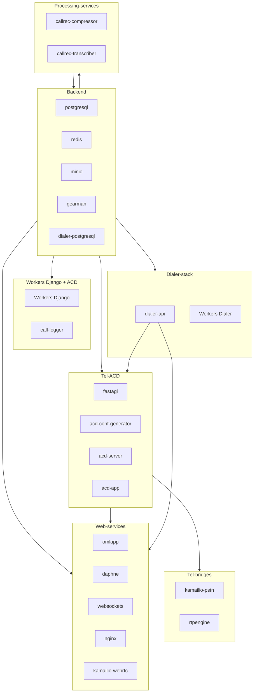

# Documentación del stack de despliegue

Este documento describe la función de cada servicio definido en los `docker-compose.yml` de OMniLeads. Los tres entornos disponibles comparten la misma arquitectura base — **OMniLeads** (contact center) + **OMniDialer** + componentes de telefonía (SIP, WebRTC, ACD) — y se diferencian por los servicios opcionales y por la red que usan los servicios de borde:

| Entorno     | Ubicación                              | Servicios opcionales / extra                                                                 | Red de `kamailio-pstn` y `rtpengine` |
|-------------|----------------------------------------|----------------------------------------------------------------------------------------------|----------------------------------------|
| `test-env`  | `docker-compose/test-env/`             | `pbxemulator`, `nginxcgi`, `redisinsight`, `pgadmin`                                          | bridge `omnileads`                     |
| `prod-env`  | `docker-compose/prod-env/`             | — (stack mínimo, sin QA ni herramientas administrativas)                                      | `network_mode: host`                   |
| `dev-env`   | `docker-compose/dev-env/`              | Igual que `test-env` + `vue-cli` y `vue-build` (front-end Vue.js montado desde el repo)       | bridge `omnileads`                     |

Las variables de entorno, hostnames y puertos se configuran en el `.env` ubicado dentro de cada uno de esos directorios.

---

## Backend

Servicios de datos e infraestructura compartida: bases de datos, caché, almacenamiento de objetos y cola de trabajos.

| Servicio | Función |
|----------|---------|
| **postgresql** | Base de datos principal de OMniLeads. Almacena configuración, usuarios, campañas, reportes y datos de llamadas (puerto 5432). |
| **redis** | Cache, sesiones, pub/sub y colas en tiempo real (con RedisGears). Usado por la web, los workers, los websockets y el ACD. |
| **minio** | Almacenamiento de objetos compatible con S3 para grabaciones y archivos media. API en `:9000` y consola en `:9001`. Con límites de recursos (`1G` / `0.5 CPU`). |
| **createbuckets** | Tarea one-shot (`restart: "no"`) que, al levantar el stack, crea el bucket `omnileads`, el usuario `omlminio` y asigna la política `readwrite`. |
| **gearman** | Cola de trabajos distribuidos. La usan el ACD (registro de llamadas), el dialer (campañas/contactos/eventos) y los procesos post-llamada. |
| **dialer-postgresql** | Base de datos exclusiva del OMniDialer (puerto interno 5433). Se inicializa con `../omnidialer.sql`. |

---

## Tel-ACD (Asterisk / ACD)

Componentes del *Automatic Call Distribution*: Asterisk como PBX/ACD, generación de configuración, FastAGI y aplicación ARI.

| Servicio | Función |
|----------|---------|
| **fastagi** | Servicio FastAGI consultado por Asterisk para lógica de llamadas (AMD, enrutamiento, etc.). Conecta con PostgreSQL, Redis y Gearman. |
| **acd-conf-generator** | Genera la configuración de Asterisk (`astconf.py`) a partir de los datos de OMniLeads y la escribe en el volumen compartido `asterisk_conf`. |
| **acd-server** | Asterisk como PBX/ACD. Gestiona llamadas, colas y grabaciones (volúmenes `asterisk_callrec`, `asterisk_conf`, `asterisk_sounds`). Recibe una IP fija (`ACD_SERVER_IP`) dentro de la red `omnileads`. |
| **acd-app** | Aplicación ARI (Asterisk REST Interface) que orquesta llamadas en Asterisk vía Stasis: transferencias, grabación, integración con el dialer y con la API REST de OMniLeads. |

---

## Tel-bridges (puentes SIP/RTP)

Proxy SIP para PSTN y media proxy RTP. En `test-env` y `dev-env` usan la red bridge `omnileads`; en `prod-env` se ejecutan en `network_mode: host` para publicar puertos directamente sobre las interfaces del host.

| Servicio | Función |
|----------|---------|
| **kamailio-pstn** | Proxy SIP para tráfico PSTN. Enruta llamadas entrantes/salientes hacia el ACD y se apoya en `rtpengine` para el media. Usa la trunk hacia los ITSPs definidos en `ITSP_NODES`. |
| **rtpengine** | Media proxy RTP/SRTP. Intermedia el tráfico de audio/video entre WebRTC (SRTP) y RTP clásico (Asterisk, troncales). Rango de puertos `RTPENGINE_RTP_PORT_MIN` – `RTPENGINE_RTP_PORT_MAX`. |

---

## Web-services

Servidor web, aplicación Django (uWSGI/ASGI), WebSockets y proxy SIP WebRTC. Punto de entrada HTTP/HTTPS y de conexiones en tiempo real.

| Servicio | Función |
|----------|---------|
| **omlapp** | Aplicación web principal (uWSGI). Expone la UI y las APIs REST de OMniLeads. Healthcheck contra `:8099/`. En `dev-env` monta el código fuente desde `${REPO_PATH}/django/` y arranca con `init_devenv.sh`; en `test-env`/`prod-env` corre `init_uwsgi.sh`. |
| **daphne** | Servidor ASGI para peticiones asíncronas y WebSockets de Django Channels. Atiende canales y conexiones en tiempo real. |
| **websockets** | Servidor WebSocket dedicado (puerto interno 8000) para presencia, notificaciones y actualizaciones en vivo. |
| **nginx** | Reverse proxy HTTPS (puerto 443). Sirve estáticos, reparte tráfico a `omlapp` (WSGI), `daphne` (ASGI), `websockets` y `kamailio-webrtc`. Punto de entrada único desde el exterior. En `dev-env` monta los certificados desde `../.custom_conf/certs/`. |
| **kamailio-webrtc** | Proxy SIP para clientes WebRTC: registro de extensiones, autenticación efímera (`AUTHEPH_SK`) y enrutamiento hacia Asterisk. |

---

## Workers (Django + ACD)

Workers que ejecutan tareas en segundo plano, listeners de eventos y schedulers contra Django y el ACD.

| Servicio | Función |
|----------|---------|
| **whatsapp** | Worker de integración con WhatsApp; procesa mensajes y eventos del canal. |
| **background-tasks** | Worker general de tareas en segundo plano (emails, reportes, etc.). |
| **supervision-events-listener** | Escucha eventos de supervisión y los procesa para actualizar estado y reportes. |
| **presence-heartbeat-scheduler** | Scheduler de heartbeats de presencia de agentes para el dashboard en tiempo real. |
| **daily-redis-cleanup** | Limpieza diaria de datos temporales en Redis. |
| **background-dialer-tasks** | Listener `omnidialer_events_listener`; sincroniza estado entre Django y el OMniDialer. |
| **dashboard-agent-scheduler** | Actualización programada del reporte del día actual por agente. |
| **supervision-agentes-scheduler** | Actualización programada de los reportes de supervisores. |
| **call-logger** | Worker Gearman que recibe los eventos de llamadas emitidos por el ACD y los persiste en PostgreSQL (duración, disposición, etc.). |

---

## Dialer-stack

Pila del OMniDialer: API y workers Gearman que procesan campañas, contactos y eventos. La base de datos del dialer (`dialer-postgresql`) se documenta en la sección *Backend*.

| Servicio | Función |
|----------|---------|
| **dialer-api** | API HTTP del dialer (puerto interno 1440). Recibe órdenes desde Django para crear, pausar, reanudar o detener campañas y gestionar contactos. |
| **dialer-process-contact** | Worker Gearman: procesamiento de contactos (marcado, resultado, reagenda). Escala con `DIALER_PROCESS_CONTACT_REPLICAS`. |
| **dialer-process-camp** | Worker Gearman: procesamiento de campañas (estado, progreso). Escala con `DIALER_PROCESS_CAMPAIGN_REPLICAS`. |
| **dialer-process-event** | Worker Gearman: procesamiento de eventos del dialer. Escala con `PROCESS_EVENT_REPLICAS`. |
| **dialer-scheduler** | Worker Gearman: programación de la agenda de contactos (`schedule-agenda`). |
| **dialer-start-camp** | Worker Gearman: inicio de campañas. |
| **dialer-create-camp** | Worker Gearman: creación de campañas. |
| **dialer-resume-camp** | Worker Gearman: reanudación de campañas pausadas. |
| **dialer-edit-camp** | Worker Gearman: edición de campañas. |
| **dialer-stop-camp** | Worker Gearman: detención de campañas. |
| **dialer-pause-camp** | Worker Gearman: pausa de campañas. |
| **dialer-delete-camp** | Worker Gearman: eliminación de campañas. |
| **dialer-change-database-camp** | Worker Gearman: cambio de la base de contactos de una campaña. |
| **dialer-send-reports** | Worker Gearman: envío de reportes del dialer. |
| **dialer-add-incidence-rule** | Worker Gearman: alta de reglas de incidencia por disposición. |
| **dialer-create-incidence-rule** | Worker Gearman: creación de reglas de incidencia. |
| **dialer-delete-incidence-rule** | Worker Gearman: eliminación de reglas de incidencia. |
| **dialer-update-incidence-rule** | Worker Gearman: actualización de reglas de incidencia. |
| **dialer-render-template** | Worker Gearman: renderizado de plantillas (por ejemplo, reportes). |
| **dialer-manage-dialer** | Worker Gearman: tareas de gestión general del dialer. |

---

## Processing-services (post-llamada)

Procesamiento de las grabaciones generadas por Asterisk: compresión y subida a S3/MinIO y transcripción/summarization opcional.

| Servicio | Función |
|----------|---------|
| **callrec-compressor** | Comprime las grabaciones que llegan al volumen `asterisk_callrec` y las publica en el bucket S3/MinIO. |
| **callrec-transcriber** | Transcripción y/o resumen de grabaciones. Soporta varios motores STT (`STT_ENGINE`: `openai`, `gemini`, `gcp`, `local`/faster-whisper) y summarization con Gemini (`SUMMARIZE_ENGINE`, `SUMMARIZE_MODEL`, `SUMMARIZE_ENABLED`, `GEMINI_API_KEY`). Cachea modelos locales en el volumen `faster_whisper_cache`. |

---

## Servicios opcionales y utilidades

Utilidades on-demand y servicios auxiliares para administración o QA. **Solo se incluyen en `test-env` y `dev-env`** (excepto `django-commands`, que está en los tres).

| Servicio | Disponible en | Función |
|----------|----------------|---------|
| **django-commands** | test-env, prod-env, dev-env | Contenedor one-shot que ejecuta `django_commands.sh` (migraciones, `collectstatic`, etc.) al levantar el stack o bajo demanda con `./oml_manage.sh django-commands`. |
| **pbxemulator** | test-env, dev-env | Emulador PSTN para QA. Simula respuestas de llamadas (atendida, ocupado, congestión, no contesta, …) según `PSTN_EMULATOR_MODE`. Expone `4569/udp` y recibe IP fija (`PSTN_EMULATOR_IP`). |
| **nginxcgi** | test-env, dev-env | Nginx auxiliar de QA que expone scripts CGI internos. Puerto host `8888`. |
| **redisinsight** | test-env, dev-env | Interfaz web para inspeccionar Redis. Publicado en `127.0.0.1:7963 → 5540`. |
| **pgadmin** | test-env, dev-env | Interfaz web para administrar PostgreSQL (base principal y `dialer-postgresql`). Publicado en `127.0.0.1:5050 → 80`. Credenciales por defecto: `PGADMIN_DEFAULT_EMAIL` / `PGADMIN_DEFAULT_PASSWORD` (`admin@omnileads.com` / `admin`). |
| **vue-cli** | dev-env | Front-end Vue (modo dev server) montado sobre `${REPO_PATH}/django/omnileads_ui/`. Publicado en `localhost:8081`. |
| **vue-build** | dev-env | Job one-shot (`restart: "no"`) que ejecuta `npm ci` / `npm run build` para generar el `dist/` que consume `omlapp`. `omlapp` espera su finalización (`service_completed_successfully`). |

> En `prod-env` ninguna de estas herramientas administrativas/QA está incluida; sólo se mantiene `django-commands`.

---

## Diagrama de dependencias (alto nivel)



---

## Configuración y despliegue

Las variables de entorno, hostnames y puertos se definen en el `.env` ubicado dentro de cada uno de los entornos (`test-env/.env`, `prod-env/.env`, `dev-env/.env`). El flujo recomendado utiliza el helper `oml_manage.sh` que ya viene en cada carpeta:

```bash
# Ejemplo en test-env
cp env test-env/.env
cd test-env
./set_test_env.sh
./oml_manage.sh up -d
./oml_manage.sh reset-pass
./oml_manage.sh data-generate
```

Comandos equivalentes con Docker Compose directo (sin el helper):

```bash
docker compose -f docker-compose/test-env/docker-compose.yml \
  --env-file docker-compose/test-env/.env \
  up -d
```

Todos los servicios definidos en el `docker-compose.yml` se levantan por defecto; los servicios listados como **opcionales** (RedisInsight, pgAdmin, nginxcgi, vue-cli, etc.) sólo aparecen en los `docker-compose.yml` de `test-env` y `dev-env`, por lo que para no levantarlos basta con usar `prod-env` o con eliminarlos del compose.

Para más detalles operativos (firewall, build de imágenes propias, emulador PSTN, herramientas administrativas) ver [`README.md`](./README.md).
